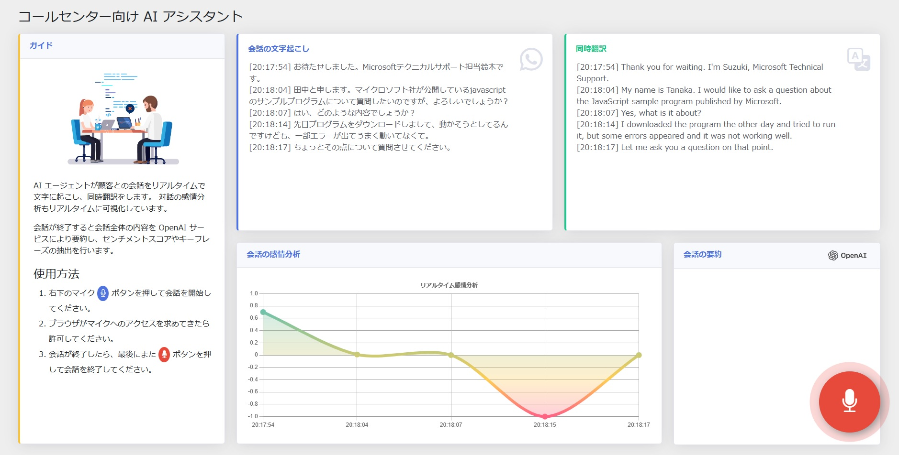
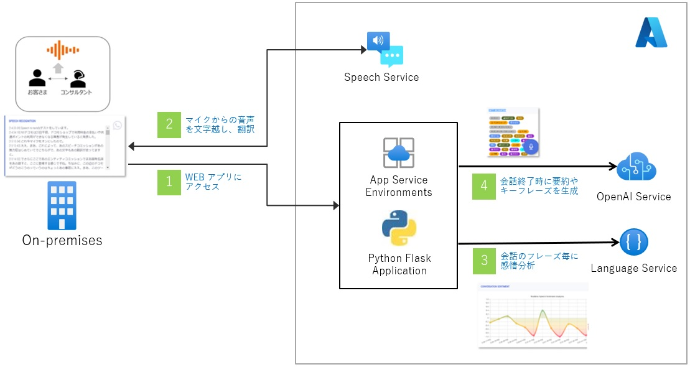
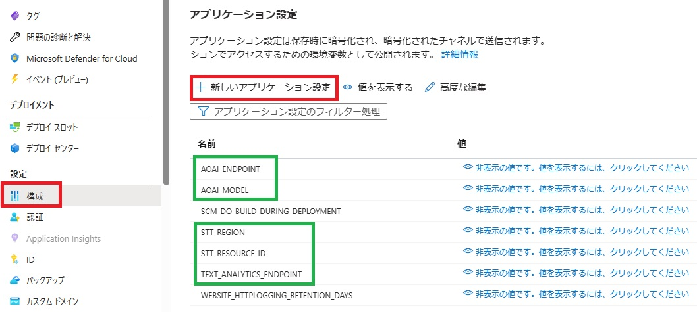
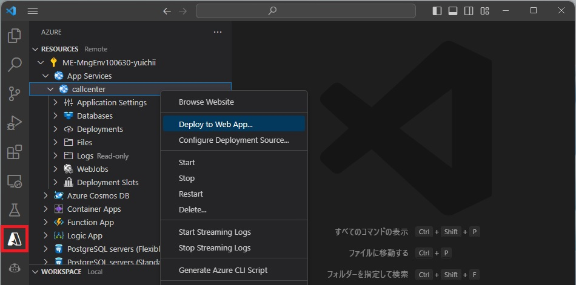

# コールセンター向け AI アシスタント

## 概要

コールセンターのスタッフを支援する Microsoft AI の機能を活用したソリューションとなります。機能を拡張しリアルタイムに取得した会話データをストレージやデーターベースに収集する事で、顧客とのコミュニケーション分析の基盤システムへの展開も想定しています。

### 主な機能  

1. リアルタイムに会話の`文字起こし`が出来ます。
2. 同時に他言語に`翻訳`します。
3. リアルタイムに会話内容の`感情分析`をします。
4. 会話が終了した際、全体の会話内容を`要約`し、重要な`トピック`をリストアップします。

### アプリケーション画面



### クラウド実行環境

WEB アプリケーションを Azure App Service でホストしたソリューション・ダイアグラムとなります。




|  サービス名  |  SKU  | Note |
| ---- | ---- | ---- |
| Azure App Service  |  Standard (S1) | Python 3.11 |
| Azure OpenAI Service |  Standard  | gpt-35-turbo |
| Speech Services |  Standard  | |
| Language Services |  Standard  | |

## 開発環境の準備

### ローカル開発環境

- Python 3.11
- Visual Studio Code
    - Azure App Service 拡張機能 
    - Python 拡張機能

クラウドに下記サービスがデプロイされている必要があります。

|  サービス名  |  SKU  | Note |
| ---- | ---- | ---- |
| Azure OpenAI Service |  Standard  | gpt-35-turbo |
| Speech Services |  Standard  | |
| Language Services |  Standard  | |

### Azure AI サービス群のデプロイ

[Azure Cloud Shell](https://learn.microsoft.com/ja-jp/azure/cloud-shell/quickstart?tabs=azurecli) から、以下のコマンドを実行する事でデプロイ出来ます。

```bash
# 環境変数
export RESOURCE_GROUP=<Your resource group>
export SPEECHSERVICE_NAME=<Your speech service name>
export LANGUAGE_SERVICE_NAME=<Your language service name>
export OPENAI_NAME=<Your OpenAI service name>

export REGION="japaneast"

# RESOURCE GROUP
az group create --location $REGION --resource-group $RESOURCE_GROUP

# SPEECH SERVICE
az cognitiveservices account create --name $SPEECHSERVICE_NAME --resource-group $RESOURCE_GROUP \
 --kind SpeechServices --sku S0 --location $REGION --custom-domain $SPEECHSERVICE_NAME --yes

# LANGUAGE_SERVICE
az cognitiveservices account create --name $LANGUAGE_SERVICE_NAME --resource-group $RESOURCE_GROUP \
 --kind TextAnalytics --sku S --location $REGION --custom-domain $LANGUAGE_SERVICE_NAME --yes

# OPENAI
az cognitiveservices account create --name $OPENAI_NAME --resource-group $RESOURCE_GROUP \
 --kind OpenAI --sku S0 --location $REGION --custom-domain $OPENAI_NAME --yes
```

上記コマンドの実行後、[Azure Open AI Studio](https://oai.azure.com/) を使用して、[gpt-35-turbo モデルをデプロイ](https://learn.microsoft.com/ja-jp/azure/cognitive-services/openai/how-to/create-resource?pivots=web-portal#deploy-a-model)してください。デプロイしたモデル名は、後の手順で環境変数の値として利用するので、手元に控えておいてください。

> Azure Text Analytics を一度もご利用戴いたことがない場合、上記の `az cognitive...` コマンドのうち、**LANGUAGE_SERVICE** の実行が失敗します。その場合は、Text Analytics のリソースを Azure Portal 上から作成してください。

### 1. アクセス制御 (IAM) の構成

VSCode の Azure 拡張機能で Azure へサインインする事で、サインインしているユーザーがデバッグ実行の際の DefaultAzureCredential となります。 

Azure ポータルで各バックエンドサービスの [アクセス制御 (IAM)] メニューを開き、サインインユーザーに対して以下の権限（ロール）を割り当てます。 

|  サービス名  |  ロール  | 
| ---- | ---- |
| Azure OpenAI Service |  Cognitive Services OpenAI User  | 
| Speech Services |  Cognitive Services Speech ユーザー  |
| Language Services |  Cognitive Services Language 閲覧者  |

### 2. ローカルデバッグ用の環境変数設定

call-center フォルダ配下の `app` フォルダを VSCode で開きます。`.vscode/launch.json` ファイルで <Your ...> の値を環境に合わせて設定します。

```json
"env": {
    "FLASK_APP": "${workspaceFolder}/app.py",
    "FLASK_DEBUG": "1",
    "STT_REGION": "<Your Service Region>",
    "STT_RESOURCE_ID": "/subscriptions/<Your Subscription GUID>/resourceGroups/<Your ResourceGroup Name>/providers/Microsoft.CognitiveServices/accounts/<Your Service Name>",
    "TEXT_ANALYTICS_ENDPOINT": "https://<Your Service Name>.cognitiveservices.azure.com",
    "AOAI_ENDPOINT": "https://<Your Service Name>.openai.azure.com",
    "AOAI_MODEL": "<<Your Model Name>>"
}
```

※ `STT_RESOURCE_ID` は、デプロイした Speech Service の [プロパティ] メニューで確認できます。

### 3. モジュールのインストール

```bash
pip install -r requirements.txt
```

※ VSCode で textanalytics など一部モジュールの解決が出来ない場合は、Python インタープリタを切り替える事で解決する場合があります。Ctrl+Shift+P または [View] > [Command Palette] メニューから、出てきた検索ウィンドウにPython: Select Interpreterと入力することで設定できます。

### 4. デバッグ実行

VSCode からデバッグ実行を開始します。

Running on http://127.0.0.1:5000


## Azure へのデプロイ

### 1. Azure App Servce の作成

[Azure Cloud Shell](https://learn.microsoft.com/ja-jp/azure/cloud-shell/quickstart?tabs=azurecli) から、以下のコマンドを実行します。

```bash
# 環境変数
export RESOURCE_GROUP=<Your resource group>
export APPSERVICE_PLAN=<Your appservice plan>
export APPSERVICE=<Your appservice>

export REGION="japaneast"

# RESOURCE GROUP
az group create --location $REGION --resource-group $RESOURCE_GROUP

# APP SERVICE PLAN
az appservice plan create --name $APPSERVICE_PLAN --resource-group $RESOURCE_GROUP --is-linux --sku S1

# APP SERVICE
az webapp create --name $APPSERVICE --resource-group $RESOURCE_GROUP --plan $APPSERVICE_PLAN \
                --runtime PYTHON:3.11 --assign-identity [system] --https-only
```

### 2. App Service 構成 - 環境変数の設定

Azure ポータルで App Service の [構成] メニューを選択し、開発環境の launch.json に定義してある環境変数を設定します。




### 3. アクセス制御 (IAM) の構成

Azure ポータルで、各バックエンドサービスの [アクセス制御 (IAM)] メニューを開き App Service の Managed ID に以下の権限（ロール）を割り当てます。 

|  サービス名  |  ロール  | 
| ---- | ---- |
| Azure OpenAI Service |  Cognitive Services OpenAI User  | 
| Speech Services |  Cognitive Services Speech ユーザー  |
| Language Services |  Cognitive Services Language 閲覧者  |

### 4. WEB アプリケーションを App Service へデプロイ

VSCode の左側ペインより Azure アイコンを選択し、該当する [App Service] に対して [Deploy to Web App...] にてアプリケーションを展開します。



## Credit

Special thanks to [Jixin Jia (Gin)](https://github.com/jixjia) and [Nobu Tanahashi](https://github.com/notanaha) for his ingenious Conversation Transcription source code and idea used in this demo.
