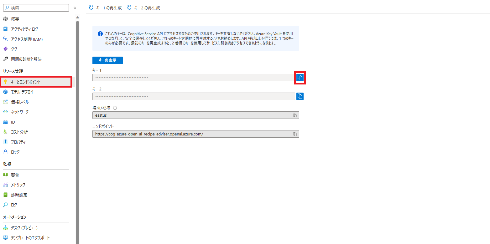
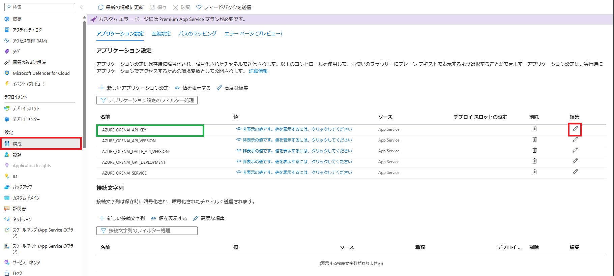
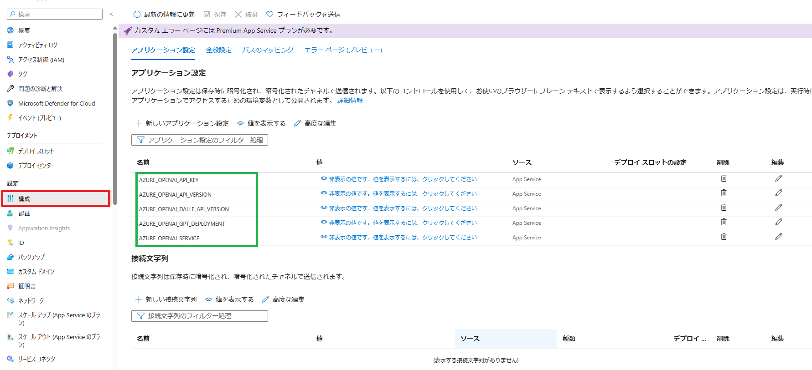

# AIによる料理レシピ提案

## 概要
このプロジェクトは、Azure OpenAIを使用して、家族の情報や自宅にある食材、およびユーザーのリクエストに基づいて、自動的にメニューや料理画像を生成するアプリケーションのためのサンプルアーキテクチャを提供します。
アプリケーションは、ユーザーが提供した家族の情報を分析し、利用可能な食材とリクエストに基づいて最適なメニューを作成します。
Azure Open AIを使用して、自動的にレシピを生成し、それに基づいて料理画像を生成することも可能です。
AIを活用して食事プランニングを効率化し、ユーザーに料理のアイデアを提供することができます。

### 主な機能
1. 自宅にある食材を考慮したメニューを`生成`することができます
2. 提案されたメニューを`画像生成`することができます
3. 家族の健康度をスコアとして分析し、不足している栄養素についてアドバイスを`生成`します

### アプリケーション画面

## セットアップガイド
### クラウド実行環境
以下は "検証用途の最小構成" を示しています。

| サービス名 | SKU | Note |
| --- | --- | --- |
| Azure App Service | S1 |  |
| Azure OpenAI Service | S0 | text-davinci-003, DALL-E |

### ローカル開発環境
- Visual Studio Code
  - Python 拡張機能
- Python 3.10

クラウドに下記サービスがデプロイされている必要があります。
リソースをデプロイする方法については [Azure へのデプロイ](#azure-へのデプロイ) を参照してください。

| サービス名 | SKU | Note |
| --- | --- | --- |
| Azure App Service | S1 |  |
| Azure OpenAI Service | S0 | text-davinci-003, DALL-E |

## Azure へのデプロイ
### 1. Azure デプロイリソースの変数を設定
`infra/main.paramaters.json`を開き、リソースの値を設定します。

### 2. Azure リソースの構築

[Azure Developer CLI](https://learn.microsoft.com/ja-jp/azure/developer/azure-developer-cli/install-azd?tabs=winget-windows%2Cbrew-mac%2Cscript-linux&pivots=os-windows)を使用して、以下のコマンドを実行します。

```bash
azd up
```

### 3. Azure Open AI Service キーとエンドポイント - キーの取得
Azure ポータルで Azure Open AI Service の [キーとエンドポイント] メニューを選択し、キー1を取得します。



### 4. App Service 構成 - 環境変数の設定
Azure ポータルで App Service の [構成] メニューを選択し、`AZURE_OPENAI_API_KEY`の値に、3で取得したキーを設定します。



## 開発環境の準備
### 1. ローカルデバッグ用の環境変数設定
`./app/.env.example`をコピーし、`./app/.env`を作成します。

```bash
cp ./app/.env.example ./app/.env
```

`./app/.env`を開き、App Serviceの環境変数を設定します。



### 2. venv を用いた仮想環境の構築
```bash
python3 -m venv .venv
source .venv/bin/activate
```

### 3. 依存関係のインストール、デバッグ実行
```bash
cd ./app/backend
pip install -r requirements.txt
```

```bash
python3 app.py
```

- Docker をご利用の場合は以下から開発環境を構築することができます。
```bash
cd app
docker-compose up -d
```
