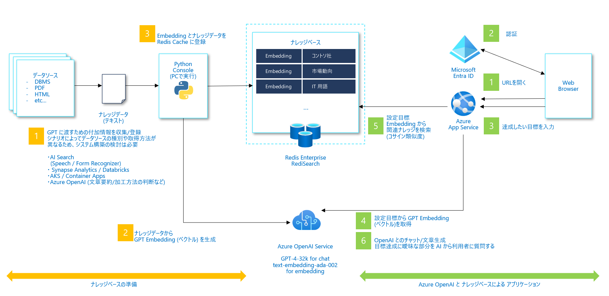

# 目標達成アシスタント

## 概要

このプロジェクトは、Azure Open AIを使用して、アドバイザー/メンターのように目標達成までの道筋をガイドするアプリケーションのためのサンプルアーキテクチャを提供します。
また、目標達成のプランニングに必要な情報を収集し、体系的な形でまとめてくれるアプリケーションを作成することができます。​

### 主な機能

以下のような状況で役に立つアプリケーションを作成することができます​

- 商品企画​
- パーソナルトレーニング​
- キャリアプランニング

### アプリケーション画面


### アーキテクチャ


## セットアップガイド

### クラウド実行環境
以下は "検証用途の最小構成" を示しています。

| サービス名 | SKU | Note |
| --- | --- | --- |
| Azure App Service | B1 |  |
| Azure OpenAI Service | S0 | text-davinci-003, text-embedding-ada-002, gpt-35-turbo |
| Azure Cache for Redis Enterprise | E10 |  |
| Storage account | Standard_LRS |  |

### ローカル開発環境
- Ubuntu on WSL2 (bash ターミナル)
- Visual Studio Code
  - Python 拡張機能
- Python 3.10
- Node.js v18.12
- Azure CLI

クラウドに下記サービスがデプロイされている必要があります。
リソースをデプロイする方法については [Azure へのデプロイ](#azure-へのデプロイ) を参照してください。

| サービス名 | SKU | Note |
| --- | --- | --- |
| Azure App Service | B1 |  |
| Azure OpenAI Service | S0 | text-davinci-003, text-embedding-ada-002, gpt-35-turbo |
| Azure Cache for Redis Enterprise | E10 |  |
| Storage account | Standard_LRS |  |

### Azure へのデプロイ

一部手動の手順を含みます。Bicep でのデプロイと手動でのデプロイを組み合わせて実施します。

#### Bicep 対応済みのリソースのプロビジョニング

以下はターミナルでの実行例です。Azure CLI がインストールされていることを前提とします。

```bash
git clone https://github.com/customer-success-microsoft/goal-achievement-adviser.git

cd goal-achievement-adviser
cd infra

az deployment sub create \
	--parameter environmentName=goal-achievement-adviser \
	--parameter location=japaneast \
	--parameter openAiResourceGroupLocation=eastus \
	--parameter principalId=YOUR-PRINCIPAL-ID \
	--location japaneast \
	--template-file ./main.bicep
```

YOUR-PRINCIPAL-IDの取得方法例: `Azure Portal > Azure AD > Users > 自分の名前で検索 > Object ID` をコピーしてください。

#### 手動でのプロビジョニング・設定

##### Redis Enterprise をプロビジョニングする

1. Azure Portal から `Azure Cache for Redis` を選択し、`Create Redis Cache` をクリックします
1. Resource group, DNS Name に適当な値、Location を `South Central US`, Cache type を `Enterprise E10` とし、利用規約にチェックを付けて Next をクリック
1. Advanced のタブで Module に `RediSearch` を選択し、Clustering Policy を Enterprise に設定し Next をクリック
1. リソースを生成

###### App Service にアプリケーションをデプロイする

**ローカル開発環境**

- Python 3.10
- Node.js v18.12.1

**手順**

フロントエンドアプリをビルドします

```bash
cd app/frontend
npm install && npm run build
# backend/static に静的ファイル群が出力されます
```

バックエンドアプリをセットアップをします

```bash
cd ../backend

# .env.example.json ファイルをベースにご自身の環境に合った環境変数を .env.json に設定します
cp .env.example.json .env.json

# App Service に環境変数を設定します
az webapp config appsettings set \
	--resource-group rg-goal-achievement-adviser \
	--name app-backend-xxxxxx \
	--settings @.env.json
```

以下の手順で Visual Studio Code から App Service にアプリをデプロイします

1. `app/backend` をルートディレクトリとして VSCode を開く
1. VSCode の Azure Extension で RESOURCES > YOUR-SUBSCRIPTION > App Services > `Bicep でデプロイした App Service リソース`を選択し右クリック
1.  `Deploy to Web App` を選択する

##### Redis にデータを登録する

```bash
cd scripts

# Python の仮想環境を作成し、必要なライブラリをインストール
python -m venv .venv
source .venv/bin/activate
pip install -r requirements.txt

# データを Redis に登録します
python gpt_manage_embedding.py
```
