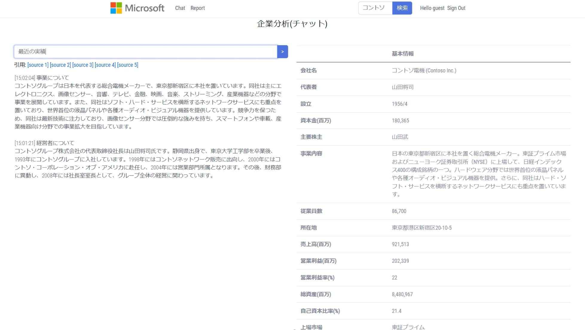
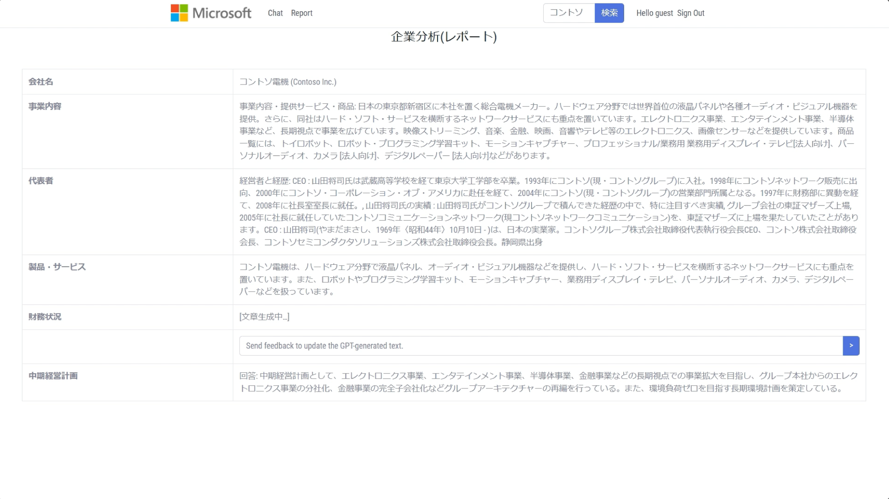
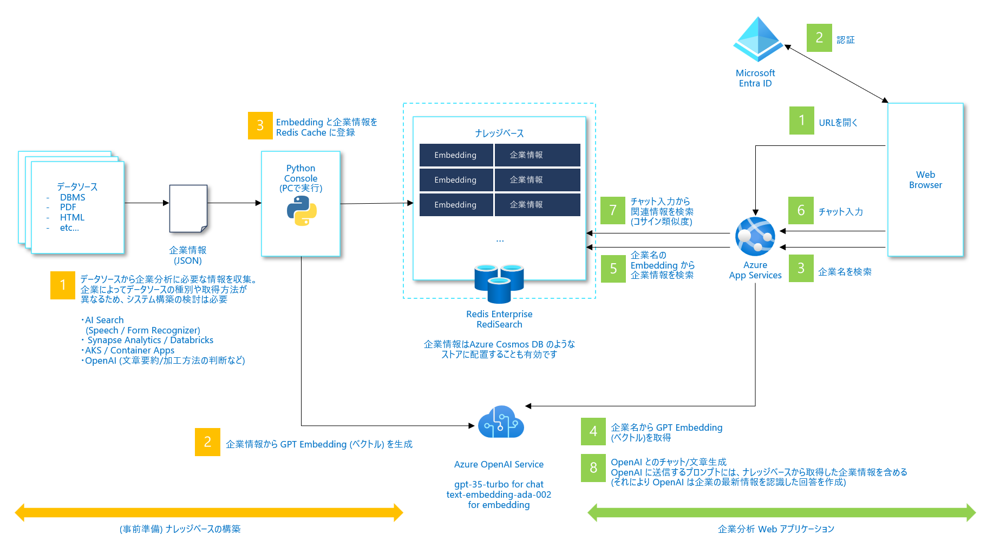

# 企業分析
## 想定利用シナリオ
Azure OpenAIを活用したアプリケーションは、法人営業がお客様先へ初回訪問する際に必要となる企業分析にも役に立ちます。

企業分析をしたい人がチャットのUIで気になることをアプリケーションに伝えることで、アプリケーションが様々な情報源から情報収集をして、企業分析に役に立たせることができます。また、収集した情報やそこから得たインサイトをレポート形式に出力することができます。

情報の取得先は、例えば以下の3つが考えられます
1. 会社名などの一般的なスタティック情報
1. 仕掛中案件など社内CRM等の情報
1. GPTに聞く情報

## 本サンプルアプリの主な機能

1. 企業情報名での企業情報の検索ができます
1. チャット形式で、より詳細な企業情報のの分析ができます
1. レポート形式で、より詳細な企業情報のの分析ができます

### アプリケーション画面




### コンポーネントとデータフロー
本サンプルアプリのコンポーネントとデータフローの図となります。



## セットアップガイド
本セットアップガイドは、以下の構成となっています。
1. [ローカル作業環境のセットアップ](#ローカル作業環境のセットアップ)
1. [クラウド実行環境のセットアップ](#クラウド実行環境のセットアップ)
1. [ナレッジベースへの企業情報の登録](#ナレッジベースへの企業情報の登録)
1. [ローカルデバッグ環境のセットアップ](#ローカルデバッグ環境のセットアップ) (任意)

### ローカル作業環境のセットアップ
以下がインストールされている環境をご準備ください
- bash
- git
- Azure CLI
- Visual Studio Code
    - Azure App Service 拡張機能 
    - Python 拡張機能
- Python 3.10

筆者はWindows 11上のWSL2環境を中心に検証をしていますが、上記がインストールされている環境であればセットアップはできる想定でガイドを書いています。

### クラウド実行環境のセットアップ
以下のAzureサービスを使います。検証用途の最小構成を前提にしています。

|  サービス名  |  SKU  | Note |
| ---- | ---- | ---- |
| Azure App Service  |  Standard (S1)  | Python 3.10 |
| Azure OpenAI Service |  Standard (S0)  | gpt-35-turbo, text-davinci-003, text-embedding-ada-002 |
| Azure Cache for Redis | Enterprise (E10) | RediSearch |

### Azureリソースのプロビジョニング
```bash
git clone https://github.com/Azure-Samples/jp-azureopenai-samples

cd jp-azureopenai-samples/4.company-research
cd infra

PRINCIPAL_ID=YOUR-PRINCIPAL-ID

az deployment sub create --parameter environmentName=company-research --parameter location=japaneast --parameter openAiResourceGroupLocation=eastus --parameter principalId=$PRINCIPAL_ID --location japaneast --template-file ./main.bicep
```
YOUR-PRINCIPAL-IDの取得方法例: Azure Portal > Azure AD > Users > 自分の名前で検索 > Object IDをコピー

#### デバッグ
##### Azure Redis Enterprise
このレポジトリにあるIaCでAzure Redis Enterpriseのデプロイ成功しない場合があることが現状確認されています。具体的には、リソースがAzure Resource Group内に表示される状態にはなるものの、Azure Redis Enterprise用のアクセスキーが表示できないという事象が起きることが確認されています。

その場合は、IaCで作成されたRedis Enterpriseを削除し、Azure Portal上から作り直してください。リソース作成には約5分かかります。

### 2. App Service 構成 - 環境変数の設定
App Serviceが使う環境変数については、一部IaCで自動設定しているものもありますが、Redisのアクセスキー等は手動で設定する必要があります。
設定が必要な環境変数については、app/backed/.env.templateをご参照ください。
Azure ポータルで App Service の [構成] メニューを選択し、環境変数を設定します。

### 3. アクセス制御 (IAM) の構成
Azure ポータルで、Azure OpenAI Serviceの [アクセス制御 (IAM)] メニューを開き、`Cognitive Services OpenAI User`権限（ロール）をApp Serviceの Managed IDにを割り当てます。 

### 4. WEB アプリケーションを App Service へデプロイ
以下のようにVS Codeを開きます
```bash
cd jp-azureopenai-samples/4.company-research/app/backend
code .
```

VSCode の左側ペインより Azure アイコンを選択し、該当する [App Service] に対して [Deploy to Web App...] にてアプリケーションを展開します。

約4分かかります。

### 5. Browse Website
Web AppのURLにアクセスします。

「企業分析(チャット)」という文字列や検索ボックスが表示されますが、まだRedisにデータを入れていないため、企業情報の検索等はできない状態です。

#### デバッグ
デバッグをする必要がある場合は、Azure Web AppのAdvanced Toolsにアクセスし、Log streamを表示するとアプリケーションログなどを見ることができます。

### ナレッジベースへの企業情報の登録
[ナレッジベースに企業の最新情報を登録](scripts/README.md)

### ローカルデバッグ環境のセットアップ
ローカルでコードのデバッグをしたい場合のセットアップ手順例を紹介します。

Pythonのウェブアプリケーションをローカル環境で実行することにより、VS Codeのデバッグ機能等を活用することができます。

##### ローカル実行時も必要なクラウドサービス
クラウドに下記サービスがデプロイされている必要があります。こちらは[クラウド実行環境のセットアップ](#クラウド実行環境のセットアップ)でセットアップしたものを使うことができます。

|  サービス名  |  SKU  | Note |
| ---- | ---- | ---- |
| Azure OpenAI Service |  Standard (S0)  | gpt-35-turbo, text-davinci-003, text-embedding-ada-002 |
| Azure Cache for Redis | Enterprise (E10) | RediSearch |

#### 1. アクセス制御 (IAM) の構成
Azureで動かす場合はApp ServiceのManaged IDにCognitive Services OpenAI User権限を追加しましたが、ローカルで実行する場合は別の方法でAzure OpenAIに対して認証認可する必要があります。

VSCode の Azure 拡張機能で Azure へサインインする事で、デバッグ実行の際にサインインユーザーの Credential が DefaultAzureCredential となります。 

Azure ポータルで各バックエンドサービスの [アクセス制御 (IAM)] メニューを開き、サインインユーザーに該当する以下の権限（ロール）を割り当てます。 

|  サービス名  |  ロール  | 
| ---- | ---- |
| Azure OpenAI Service |  Cognitive Services OpenAI User  | 

#### 2. ローカルデバッグ用の環境変数設定
```bash
cd app/backend
cp .env.template .env
```
.envファイルの値を環境に合わせて設定します。

ローカルで実行時に環境変数が読み込まれない場合は、以下の用なコードをapp.pyに追加する必要がある可能性があります。
```python
from os.path import join, dirname
from dotenv import load_dotenv

dotenv_path = join(dirname(__file__), '.env')
load_dotenv(dotenv_path)
```

#### 3. モジュールのインストール

```bash
pip install -r requirements.txt
```

#### 4. デバッグ実行

VS Code からデバッグ実行を開始します。

Running on http://127.0.0.1:5000


