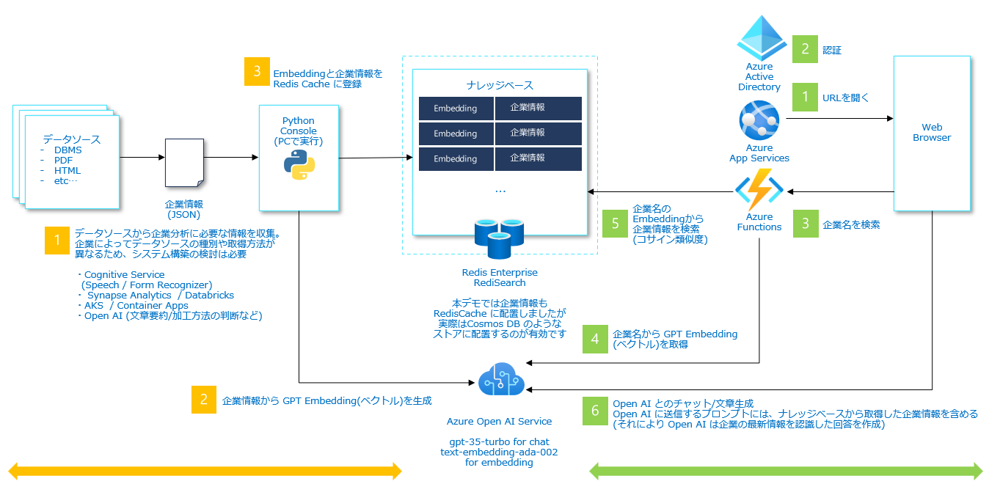

<!--=========================README TEMPLATE INSTRUCTIONS=============================
======================================================================================

- THIS README TEMPLATE LARGELY CONSISTS OF COMMENTED OUT TEXT. THIS UNRENDERED TEXT IS MEANT TO BE LEFT IN AS A GUIDE 
  THROUGHOUT THE REPOSITORY'S LIFE WHILE END USERS ONLY SEE THE RENDERED PAGE CONTENT. 
- Any italicized text rendered in the initial template is intended to be replaced IMMEDIATELY upon repository creation.

- This template is default but not mandatory. It was designed to compensate for typical gaps in Microsoft READMEs 
  that slow the pace of work. You may delete it if you have a fully populated README to replace it with.

- Most README sections below are commented out as they are not known early in a repository's life. Others are commented 
  out as they do not apply to every repository. If a section will be appropriate later but not known now, consider 
  leaving it in commented out and adding an issue as a reminder.
- There are additional optional README sections in the external instruction link below. These include; "citation",  
  "built with", "acknowledgments", "folder structure", etc.
- You can easily find the places to add content that will be rendered to the end user by searching 
within the file for "TODO".


- ADDITIONAL EXTERNAL TEMPLATE INSTRUCTIONS:
  -  https://aka.ms/StartRight/README-Template/Instructions

======================================================================================
====================================================================================-->


<!---------------------[  Description  ]------------------<recommended> section below------------------>

# 企業分析

<!-- 
INSTRUCTIONS:
- Write description paragraph(s) that can stand alone. Remember 1st paragraph may be consumed by aggregators to improve 
  search experience.
- You description should allow any reader to figure out:
    1. What it does?
    2. Why was it was created?
    3. Who created?
    4. What is it's maturity?
    5. What is the larger context?
- Write for a reasonable person with zero context regarding your product, org, and team. The person may be evaluating if 
this is something they can use.

How to Evaluate & Examples: 
  - https://aka.ms/StartRight/README-Template/Instructions#description
-->

Azure OpenAIを活用したアプリケーションは、法人営業がお客様先へ初回訪問する際に必要となる企業分析にも役に立ちます。

企業分析をしたい人がチャットのUIで気になることをアプリケーションに伝えることで、アプリケーションが様々な情報源から情報収集をして、企業分析に役に立たせることができます。また、収集した情報やそこから得たインサイトをレポート形式に出力することができます。

情報の取得先は、例えば以下の3つが考えられます
１．会社名などの一般的なスタティック情報
２．仕掛中案件など社内CRM等の情報
３．GPTに聞く情報

### 主な機能  

1. 企業情報名での企業情報の検索ができます
2. チャット形式で、より詳細な企業情報のの分析ができます
3. レポート形式で、より詳細な企業情報のの分析ができます

### アプリケーション画面


-----------------------------------------------------------------
<!-----------------------[  License  ]----------------------<optional> section below--------------------->

<!-- 
## License 
--> 

<!-- 
INSTRUCTIONS:
- Licensing is mostly irrelevant within the company for purely internal code. Use this section to prevent potential 
  confusion around:
  - Open source in internal code repository.
  - Multiple licensed code in same repository. 
  - Internal fork of public open source code.

How to Evaluate & Examples:
  - https://aka.ms/StartRight/README-Template/Instructions#license
-->

<!---- [TODO]  CONTENT GOES BELOW ------->

<!------====-- CONTENT GOES ABOVE ------->


<!-----------------------[  Getting Started  ]--------------<recommended> section below------------------>
## セットアップガイド

WEB アプリケーションを Azure App Service でホストしたソリューション・ダイアグラムとなります。



<!-- 
INSTRUCTIONS:
  - Write instructions such that any new user can get the project up & running on their machine.
  - This section has subsections described further down of "Prerequisites", "Installing", and "Deployment". 

How to Evaluate & Examples:
  - https://aka.ms/StartRight/README-Template/Instructions#getting-started
-->

<!---- [TODO]  CONTENT GOES BELOW ------->
### クラウド実行環境

以下は "検証用途の最小構成" を示しています。運用環境として構成する場合には後半で示されている "ランディングゾーン構成" をご検討ください。

|  サービス名  |  SKU  | Note |
| ---- | ---- | ---- |
| Azure App Service  |  S1  | Python 3.10 |
| Azure OpenAI Service |  Standard  | gpt-35-turbo, text-davinci-003, text-embedding-ada-002 |
| Azure Cache for Redis | Enterprise | |

### ローカル開発環境

- Visual Studio Code
    - Azure App Service 拡張機能 
    - Python 拡張機能
- Python 3.10

クラウドに下記サービスがデプロイされている必要があります。

|  サービス名  |  SKU  | Note |
| ---- | ---- | ---- |
| Azure OpenAI Service |  Standard  | gpt-35-turbo, text-davinci-003, text-embedding-ada-002 |
| Azure Cache for Redis | Enterprise | |

## 開発環境の準備

### 1. アクセス制御 (IAM) の構成

VSCode の Azure 拡張機能で Azure へサインインする事で、デバッグ実行の際にサインインユーザーの Credential が DefaultAzureCredential となります。 

Azure ポータルで各バックエンドサービスの [アクセス制御 (IAM)] メニューを開き、サインインユーザーに該当する以下の権限（ロール）を割り当てます。 

|  サービス名  |  ロール  | 
| ---- | ---- |
| Azure OpenAI Service |  Cognitive Services OpenAI User  | 

### 2. ローカルデバッグ用の環境変数設定

#### Option 1: .env
```
cd app\backend
cp .env.template .env
```
.envファイルの値を環境に合わせて設定します。

#### Option 2: WIP
`.vscode/launch.json` ファイルで <Your ...> の値を環境に合わせて設定します。

```json
"env": {
    "FLASK_APP": "${workspaceFolder}/app.py",
    "FLASK_DEBUG": "1",
    "AZURE_OPENAI_API_TYPE": "azure",
    ...
}
```

### 3. モジュールのインストール

```bash
pip install -r requirements.txt
```

### 4. デバッグ実行

VSCode からデバッグ実行を開始します。

Running on http://127.0.0.1:5000


## Azure へのデプロイ
## Azureリソースのプロビジョニング
```
git clone https://github.com/customer-success-microsoft/company-research

cd company-research
cd infra

$PRINCIPAL_ID=YOUR-PRINCIPAL-ID

az deployment sub create --parameter environmentName=company-research --parameter location=japaneast --parameter openAiResourceGroupLocation=eastus --parameter principalId=$PRINCIPAL_ID --location japaneast --template-file ./main.bicep
```
YOUR-PRINCIPAL-IDの取得方法例: Azure Portal > Azure AD > Users > 自分の名前で検索 > Object IDをコピー

### 2. App Service 構成 - 環境変数の設定

Azure ポータルで App Service の [構成] メニューを選択し、開発環境の .env/launch.json に定義してある環境変数を設定します。


### 3. アクセス制御 (IAM) の構成

Azure ポータルで、各バックエンドサービスの [アクセス制御 (IAM)] メニューを開き App Service の Managed ID に該当する以下の権限（ロール）を割り当てます。 

|  サービス名  |  ロール  | 
| ---- | ---- |
| Azure OpenAI Service |  Cognitive Services OpenAI User  | 

### 4. WEB アプリケーションを App Service へデプロイ

VSCode の左側ペインより Azure アイコンを選択し、該当する [App Service] に対して [Deploy to Web App...] にてアプリケーションを展開します。

約4分かかります。


# ナレッジベースに企業の最新情報を登録
[ナレッジベースに企業の最新情報を登録](scripts/README.md)

<!------====-- CONTENT GOES ABOVE ------->

<!-----------------------[  Deployment (CI/CD)  ]-----------<optional> section below--------------------->
<!-- 
### CI/CD
-->

<!-- 
INSTRUCTIONS:
- Describe how to deploy if applicable. Deployment includes website deployment, packages, or artifacts.
- Avoid potential new contributor frustrations by making it easy to know about all compliance and continuous integration 
    that will be run before pull request approval.
- NOTE: Setting up an Azure DevOps pipeline gets you all 1ES compliance and build tooling such as component governance. 
  - More info: https://aka.ms/StartRight/README-Template/integrate-ado

How to Evaluate & Examples:
  - https://aka.ms/StartRight/README-Template/Instructions#deployment-and-continuous-integration
-->

<!---- [TODO]  CONTENT GOES BELOW ------->
<!-- 
_At this time, the repository does not use continuous integration or produce a website, artifact, or anything deployed._
-->
<!------====-- CONTENT GOES ABOVE ------->


<!-----------------------[  Versioning and Changelog  ]-----<optional> section below--------------------->

<!-- ### Versioning and Changelog -->

<!-- 
INSTRUCTIONS:
- If there is any information on a changelog, history, versioning style, roadmap or any related content tied to the 
  history and/or future of your project, this is a section for it.

How to Evaluate & Examples:
  - https://aka.ms/StartRight/README-Template/Instructions#versioning-and-changelog
-->

<!---- [TODO]  CONTENT GOES BELOW ------->
<!-- We use [SemVer](https://aka.ms/StartRight/README-Template/semver) for versioning. -->
<!------====-- CONTENT GOES ABOVE ------->


-----------------------------------------------

<!-----------------------[  Access  ]-----------------------<recommended> section below------------------>
<!-- 
## Access
-->
<!-- 
INSTRUCTIONS:
- Please use this section to reduce the all-too-common friction & pain of getting read access and role-based permissions 
  to repos inside Microsoft. Please cover (a) Gaining a role with read, write, other permissions. (b) sharing a link to 
  this repository such that people who are not members of the organization can access it.
- If the repository is set to internalVisibility, you may also want to refer to the "Sharing a Link to this Repository" sub-section 
of the [README-Template instructions](https://aka.ms/StartRight/README-Template/Instructions#sharing-a-link-to-this-repository) so new GitHub EMU users know to get 1ES-Enterprise-Visibility MyAccess group access and therefore will have read rights to any repo set to internalVisibility.

How to Evaluate & Examples:
  - https://aka.ms/StartRight/README-Template/Instructions#how-to-share-an-accessible-link-to-this-repository
-->


<!---- [TODO]  CONTENT GOES BELOW ------->

<!------====-- CONTENT GOES ABOVE ------->


<!-----------------------[  Contributing  ]-----------------<recommended> section below------------------>
## Contributing

<!--
INSTRUCTIONS: 
- Establish expectations and processes for existing & new developers to contribute to the repository.
  - Describe whether first step should be email, teams message, issue, or direct to pull request.
  - Express whether fork or branch preferred.
- CONTRIBUTING content Location:
  - You can tell users how to contribute in the README directly or link to a separate CONTRIBUTING.md file.
  - The README sections "Contacts" and "Reuse Expectations" can be seen as subsections to CONTRIBUTING.
  
How to Evaluate & Examples:
  - https://aka.ms/StartRight/README-Template/Instructions#contributing
-->

<!---- [TODO]  CONTENT GOES BELOW ------->
_This repository prefers outside contributors start forks rather than branches. For pull requests more complicated 
than typos, it is often best to submit an issue first._

If you are a new potential collaborator who finds reaching out or contributing to another project awkward, you may find 
it useful to read these [tips & tricks](https://aka.ms/StartRight/README-Template/innerSource/2021_02_TipsAndTricksForCollaboration) 
on InnerSource Communication.
<!------====-- CONTENT GOES ABOVE ------->


<!-----------------------[  Contacts  ]---------------------<recommended> section below------------------>
<!-- 
#### Contacts  
-->
<!--
INSTRUCTIONS: 
- To lower friction for new users and contributors, provide a preferred contact(s) and method (email, TEAMS, issue, etc.)

How to Evaluate & Examples:
  - https://aka.ms/StartRight/README-Template/Instructions#contacts
-->

<!---- [TODO]  CONTENT GOES BELOW ------->

<!------====-- CONTENT GOES ABOVE ------->


<!-----------------------[  Support & Reuse Expectations  ]-----<recommended> section below-------------->
 
### Support & Reuse Expectations

 
<!-- 
INSTRUCTIONS:
- To avoid misalignments use this section to set expectations in regards to current and future state of:
  - The level of support the owning team provides new users/contributors and 
  - The owning team's expectations in terms of incoming InnerSource requests and contributions.

How to Evaluate & Examples:
  - https://aka.ms/StartRight/README-Template/Instructions#support-and-reuse-expectations
-->

<!---- [TODO]  CONTENT GOES BELOW ------->

_The creators of this repository **DO NOT EXPECT REUSE**._

If you do use it, please let us know via an email or 
leave a note in an issue, so we can best understand the value of this repository.
<!------====-- CONTENT GOES ABOVE ------->


<!-----------------------[  Limitations  ]----------------------<optional> section below----------------->

<!-- 
### Limitations 
--> 

<!-- 
INSTRUCTIONS:
- Use this section to make readers aware of any complications or limitations that they need to be made aware of.
  - State:
    - Export restrictions
    - If telemetry is collected
    - Dependencies with non-typical license requirements or limitations that need to not be missed. 
    - trademark limitations
 
How to Evaluate & Examples:
  - https://aka.ms/StartRight/README-Template/Instructions#limitations
-->

<!---- [TODO]  CONTENT GOES BELOW ------->

<!------====-- CONTENT GOES ABOVE ------->

--------------------------------------------


<!-----------------------[  Links to Platform Policies  ]-------<recommended> section below-------------->
## How to Accomplish Common User Actions
<!-- 
INSTRUCTIONS: 
- This section links to information useful to any user of this repository new to internal GitHub policies & workflows.
-->

 If you have trouble doing something related to this repository, please keep in mind that the following actions require 
 using [GitHub inside Microsoft (GiM) tooling](https://aka.ms/gim/docs) and not the normal GitHub visible user interface!
- [Switching between EMU GitHub and normal GitHub without logging out and back in constantly](https://aka.ms/StartRight/README-Template/maintainingMultipleAccount)
- [Creating a repository](aka.ms/startright)
- [Changing repository visibility](https://aka.ms/StartRight/README-Template/policies/jit) 
- [Gaining repository permissions, access, and roles](https://aka.ms/StartRight/README-TEmplates/gim/policies/access)
- [Enabling easy access to your low sensitivity and widely applicable repository by setting it to Internal Visibility and having any FTE who wants to see it join the 1ES Enterprise Visibility MyAccess Group](https://aka.ms/StartRight/README-Template/gim/innersource-access)
- [Migrating repositories](https://aka.ms/StartRight/README-Template/troubleshoot/migration)
- [Setting branch protection](https://aka.ms/StartRight/README-Template/gim/policies/branch-protection)
- [Setting up GitHubActions](https://aka.ms/StartRight/README-Template/policies/actions)
- [and other actions](https://aka.ms/StartRight/README-Template/gim/policies)

This README started as a template provided as part of the 
[StartRight](https://aka.ms/gim/docs/startright) tool that is used to create new repositories safely. Feedback on the
[README template](https://aka.ms/StartRight/README-Template) used in this repository is requested as an issue. 

<!-- version: 2023-04-07 [Do not delete this line, it is used for analytics that drive template improvements] -->
