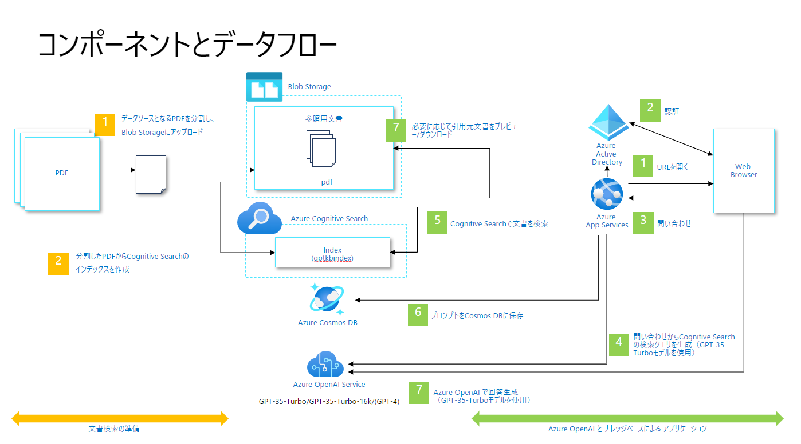
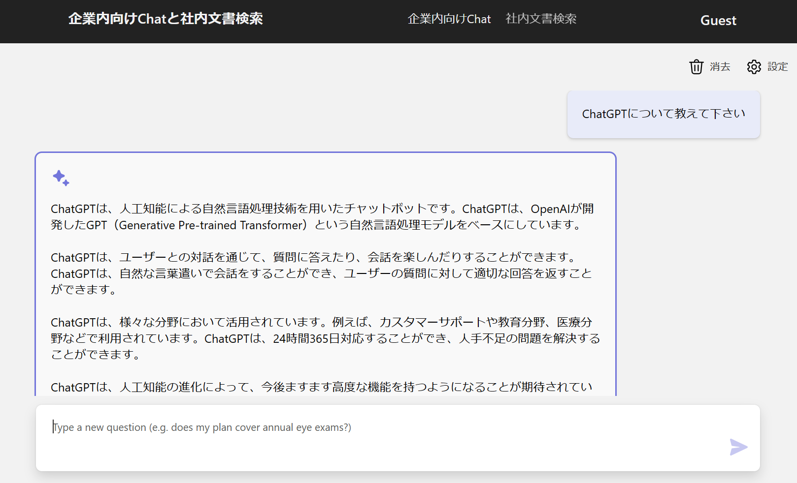

# Chat+社内文書検索

## 概要

このデモは、ChatGPT ライクなインターフェースを使用して企業の社内文書を検索するアプリケーションの実装パターンです。デモアプリを利用するためには、Azure Open AI の ChatGPT モデルと、Azure AI Search、他にいくつかのリソースの作成が必要です。

このリポジトリでは、サンプルデータに[厚生労働省のモデル就業規則](https://www.mhlw.go.jp/stf/seisakunitsuite/bunya/koyou_roudou/roudoukijun/zigyonushi/model/index.html)を使用しています。

### Architecture



### UI

デモアプリは以下のように動作します。



## 目次

- [セットアップガイド](#セットアップガイド)
    - 本資料に手順が記されています。基本的にこちらを実施してください。
- [セットアップガイド（Azure Cloud Shell 版 - azd 不使用）](./deploy_from_azurecloudshell_without_azd.md)
    - 本資料で使用するツール群のインストールが難しい場合などに、ブラウザーで処理を完結させたい場合に利用します。
    - Azure Developer CLI を使用しない手順としても参考にしてください。
- [API Management の追加](./deply_with_api_management.md)
    - [リファレンスアーキテクチャ 6 章](../6.azureopenai-landing-zone-accelerator) で紹介されている方法で Azure OpenAI を保護します。
    - 上記２つのセットアップガイドのいずれかを実施した後に実施してください。
- [プライベートネットワーク構成](./deploy_private_endpoint_ennabled.md)
    - 上記２つのセットアップガイドで構築されるパブリック構成とは異なり、Azure 仮想ネットワークを利用して閉域化された環境を構築します。


### 本サンプル以外の実装について

本サンプルは、Microsoftの米国本社を中心に開発と公開している[ChatGPT + Enterprise data with Azure OpenAI and AI Search](https://github.com/Azure-Samples/azure-search-openai-demo)を参考にしたものです。
日本の開発者に使いやすいように、日本語のREADME、日本語のサンプルデータ、Azureの日本リージョン活用のデフォルト化、プライベートネットワーク構成含む考慮事項等を追加しています。
こちらのサンプルとあわせて、是非[ChatGPT + Enterprise data with Azure OpenAI and AI Search](https://github.com/Azure-Samples/azure-search-openai-demo)の活用もご検討ください。

また本サンプルで紹介しているプライベートネットワーク構成を、[Azure CAF Landing Zone 上に移植したもの](https://github.com/nakamacchi/AzureCAF.LandingZones.Demo/blob/master/41.Spoke%20D%20(AOAI)%20%E7%A4%BE%E5%86%85%E6%96%87%E6%9B%B8%E6%A4%9C%E7%B4%A2%20%E3%82%A4%E3%83%B3%E3%83%95%E3%83%A9%E6%A7%8B%E7%AF%89/41_00_%E6%9C%AC%E3%82%B5%E3%83%B3%E3%83%97%E3%83%AB%E3%81%AB%E3%81%A4%E3%81%84%E3%81%A6.md)
も提供されています。

## セットアップガイド

### クラウド実行環境

このデモをデプロイすると以下のリソースが Azure サブスクリプション上に作成されます。

| サービス名 | SKU | Note |
| --- | --- | --- |
|Azure App Service|S1||
|Azure OpenAI Service|S0|gpt-3.5-turbo gpt-3.5-turbo-16k gpt-4 gpt-4-32k|
|Azure AI Search|S1||
|Azure Cosmos DB|プロビジョニング済みスループット||
|Azure Form Recognizer|S0||
|Azure Blob Storage|汎用v2|ZRS|
|Azure Application Insights||ワークスペース ベース|
|Azure Log Analytics|||


### 事前準備

#### Microsoft Azure に必要な設定と権限

**重要:** このサンプルをデプロイするには、以下の２つが必要になります。

- **Azureサブスクリプション**
    - Azure Open AI サービスが有効になっているサブスクリプションが必要です。
    - Azure Open AI サービスへのアクセス申請は[こちら](https://aka.ms/oaiapply)から行ってください。
- **Azure権限**:
  - Microsoft.Authorization/roleAssignments/write 権限が必要です。この権限は [Role Based Access Control Administrator](https://learn.microsoft.com/azure/role-based-access-control/built-in-roles#role-based-access-control-administrator-preview)、 [User Access Administrator](https://learn.microsoft.com/azure/role-based-access-control/built-in-roles#user-access-administrator)、または [Owner](https://learn.microsoft.com/azure/role-based-access-control/built-in-roles#owner) といったロールに含まれています。
  - Azure アカウントにはサブスクリプションレベルで Microsoft.Resources/deployments/write 権限も必要です。この権限は [Contributor](https://learn.microsoft.com/azure/role-based-access-control/built-in-roles#contributor)、または [Owner](https://learn.microsoft.com/azure/role-based-access-control/built-in-roles#owner) ロールなどに含まれています。

自身が割り当てられているロールを確認するには　[Azure Portal](https://portal.azure.com) から以下の手順で確認できます。

- `サブスクリプション` メニューを開く
- サンプルをデプロイするサブスクリプションを選択
- `アクセス制御（IAM）` メニューを開く
-  `マイ アクセスの表示` ボタンをクリック

#### ローカル開発環境に必要なソフトウェア

このデモをデプロイするためには、ローカルに以下の開発環境が必要です。

> **重要** このサンプルは Windows もしくは Linux 環境で動作します。ただし、WSL2 の環境では正常に動作しません。

- [Azure Developer CLI](https://aka.ms/azure-dev/install) （version 1.0.2以降推奨）
- [Azure CLI](https://learn.microsoft.com/cli/azure/install-azure-cli) （version 2.50.0以降推奨）
- [Python 3+](https://www.python.org/downloads/)（version 3.11以降推奨）
    - **重要**: Windows 環境では、python および pip を Path 環境変数に含める必要があります。
    - **重要**: `python --version` で現在インストールされている Python のバージョンを確認することができます。 Ubuntu を使用している場合、`sudo apt install python-is-python3` で `python` と `python3` をリンクさせることができます。    
- [Node.js](https://nodejs.org/en/download/)（version 14.18以降推奨）
- [Git](https://git-scm.com/downloads)
- [Powershell 7+ (pwsh)](https://github.com/powershell/powershell) - Windows で実行する場合のみ
   - **重要**: `pwsh.exe` が PowerShell コマンドとして実行できることを確認して下さい。


### インストール

このリポジトリをクローンし、フォルダをターミナルで開きます。
- Windows の場合は pwsh ターミナルで実行します。
- Linux や Dev Container の場合は bash ターミナルで実行します

#### ユーザーやサブスクリプションの確認

1. `az login` を実行して Azure にログインします。
1. `az account list -o table` を実行してデプロイに使用する サブスクリプション ID を控えておきます。
1. `az account set -s YOUR_SUBSCRIPTION_ID` を実行して控えておいたサブスクリプション ID を既定値に設定します。
1. `az ad signed-in-user show -o tsv --query id` を実行して、ログイン中のユーザの AAD アカウントのオブジェクトID を取得します。
1. 取得したオブジェクトID を環境変数 `AZURE_PRINCIPAL_ID` にセットします。
    - Windows 環境で実行している場合は、`$Env:AZURE_PRINCIPAL_ID="Your Object ID"`を実行します。
    - Linux 環境で実行している場合は、`export AZURE_PRINCIPAL_ID="Your Object ID"`を実行します。

#### プロジェクトの初期化

新規に環境をデプロイする場合は、以下のコマンドを実行してください。

1. `azd auth login` を実行します。
1. `azd init` を実行します。
    - `? Enter a new environment name: ` というメッセージとともに、環境名を入力するように求められます。この環境名は、Azure 上にデプロイするリソースやリソースグループの名前の一部になります。１つの Azure サブスクリプションに複数の環境を構築する場合は名前が衝突しないように異なる名前を付けてください。
    - 例） aoai-sample
    - `.azure` ディレクトリおよび環境名のディレクトリとともに、各種の構成情報を格納するファイルが作成されます。
1. `azd up` を実行します。
    - `? Select an Azure Subscription to use:` というメッセージが表示されたら、上記で設定したサブスクリプションを選択してください。
    - `? Select an Azure location to use:` というメッセージが表示されたら、デプロイしたい Azure リージョンを選択してください。
        - 現在、このサンプルに必要な Azure OpenAI のモデルは該当モデルをサポートしている**東日本**リージョンにデプロイすることが可能です。最新の情報は[こちら](https://learn.microsoft.com/en-us/azure/cognitive-services/openai/concepts/models)を参考にしてください。
    - その後 Azure 上に必要なリソースをデプロイし、アプリケーションのビルドとデプロイが実行されます。また、`./data`配下の PDF を利用して Search Index を作成します。
    - Linux 環境で実行している場合は、`chmod +x scripts/prepdocs.sh`
    - しばらくすると `Enter a value for the 'vmLoginPassword' infrastructure parameter:` というメッセージが表示され仮想マシンのパスワードを求められますが、この手順では仮想マシンを利用しないためパスワードは入力せずに Enter を押してください。
    - その後 `Save the value in the environment for future use (y/N) ` というメッセージが表示されますが、この手順では仮想マシンを利用しないため `N` を入力してください。
1. コマンドの実行が終了すると、アプリケーションにアクセスする為の URL が表示されます。この URL をブラウザで開き、サンプルアプリケーションの利用を開始してください。  

コマンド実行結果の例：


    
> 注意: アプリケーションのデプロイ完了には数分かかることがあります。"Python Developer" のウェルカムスクリーンが表示される場合は、数分待ってアクセスし直してください。

#### Easy Authの設定（オプション）

本サンプルをデプロイした直後はフロントエンドの Azure App Service に対して匿名アクセスが許可されています。
[Microsoft Entra ID に対応した Easy Auth を設定する](](https://learn.microsoft.com/ja-jp/azure/app-service/scenario-secure-app-authentication-app-service))
ことで、不特定多数からの利用を制限できます。
また Easy Auth を設定した場合、UI の右上にログインユーザのアカウント名が表示され、チャットの履歴ログにもアカウント名が記録されます。

#### アクセス元の IP アドレス制限（オプション）

本サンプルをデプロイした直後はフロントエンドの Azure App Service に対して公衆インターネットからのアクセスが可能です。
[Azure App Service に対してアクセス元の IP アドレスを制限する](https://learn.microsoft.com/ja-jp/azure/app-service/app-service-ip-restrictions?tabs=azurecli) ことも可能です。
企業環境で実施する場合など、アクセス元の パブリック IP アドレスが特定できる場合はこちらの設定も検討してください。


### アプリケーションのローカル実行とカスタマイズ

アプリケーションをローカルで実行したい場合には、以下のコマンドを実行してください。
アプリケーション以外の各サービスは `azd up` で既に Azure 上にリソースがデプロイされたものを使用します。

#### アプリケーションのローカル実行 

1. `azd login` を実行する。
2. `src` フォルダに移動する。
3. `./start.ps1` もしくは `./start.sh` を実行します。

#### Visual Studio Code を使用した backend 側のデバッグ実行

アプリケーションのカスタマイズなどの目的でデバッグ実行したい場合、以下の手順を実施することでブレークポイントなどの機能を利用可能です。
以下の操作では Visual Studio Code で本サンプルのルートディレクトリ「5.internal-document-search」を開いているものとします。

1. Visual Studio Code の [Python Extension](https://marketplace.visualstudio.com/items?itemName=ms-python.python) をインストール
1. メニューから `Run > Add Configuration...` を選択
1. Select Debugger で `Python` を選択
1. Debug Configuration で `Python file` を選択
1. `.vscode` ディレクトリに追加された `launch.json` を開いて下記のように修正する
    - `"program": "${workspaceFolder}/src/backend/app.py"` に変更
    - `"envFile": "${workspaceFolder}/.azure/YOUR_ENVIRONMENT_NAME/.env"` を追加
1. ターミナルで `src/backend` ディレクトリに移動し、`pip install -r requirements.txt` を実行
1. ソースコードの適当な場所にブレークポイントを設置
1. メニューから Run > Start Debugging を選択、または F5 キーを押下
1. Web ブラウザで `http://localhost:5000` にアクセス

#### Frontend の JavaScriptのデバッグ

1. src/frontend/vite.config.tsのbuildに `minify: false` を追加
2. ブラウザの Developer tools > Sourceでブレイクポイントを設定して実行

#### 修正したコードのデプロイ

既に Azure リソースがデプロイ済みのため `azd deploy` コマンドを実行します。

### その他の作業手順

#### デプロイしたリソースの削除

本環境でデプロイした Azure リソースの一部は常に料金が発生し続けるものがあります。
動作確認や検証作業が完了して環境が不要になったら、デプロイしたリソースを削除して課金を止めるとよいでしょう。

1. `azd down` コマンドを実行します。
1. 削除処理の確認メッセージ `? Total resources to delete:N, are you sure you want to continue? (y/N)` が表示されたら、`y` を入力してください。
1. 物理削除の確認メッセージ `? Would you like to permanently delete these resources instead allowing theiir names to be reused?` が表示されたら、`y` を入力してください。
    - Azure OpenAI Service や Form Recognizer は論理削除状態のため、物理削除（Purge）して良いか確認されます。

#### 複数の環境を構築したい場合

異なるサブスクリプションも利用したい、異なるリージョンも利用したい場合など、複数の AZD 環境を使い分けることも可能です。

```bash
# 環境の追加（.azure ディレクトリ配下に新しい環境名のディレクトリとファイルが作成されます）
azd env new AnotherEnvName
# デプロイの実行
azd up --environment AnotherEnvName
```

#### API Management の利用 (オプション)

必要に応じて、[リファレンスアーキテクチャ 6 章](https://github.com/Azure-Samples/jp-azureopenai-samples/tree/main/6.azureopenai-landing-zone-accelerator) で紹介されている Azure OpenAI API の保護をするように設定します。具体的な設定方法については [こちら](deploy_with_api_management.md) を確認して下さい。


## 本番稼働を視野にいれる場合の考慮事項

本番稼働（や本番に近い検証環境等）を視野にいれる場合、様々な考慮事項があります。
考えられる考慮事項は[Cloud Adoption Framework](https://learn.microsoft.com/azure/cloud-adoption-framework/overview)や[Well-Architected Framework](https://learn.microsoft.com/azure/well-architected/)にまとめられていますが、考慮事項は多岐にわたるので、状況に応じて重要度や緊急度等をもとにした優先順位付けが必要になります。
例えば、社内データと連携する場合にはプライベートネットワークを考慮した設計や企業のAzure基盤との連携が重要になること多くなるとことが推測されます。

### Azure共通基盤との連携

PoC/検証等の目的で小さく始めた後に、本番稼働を視野にいれる場合には、社内ガバナンス等を意識する必要があります。
その際は、[Azure Cloud Adoption Framework](https://learn.microsoft.com/azure/cloud-adoption-framework/overview)で紹介されている [Azure Enterprise Scale Landing Zone](https://learn.microsoft.com/azure/cloud-adoption-framework/ready/landing-zone/)や[Azure CAF Landing Zones 設計・構築ハンズオン](https://github.com/nakamacchi/AzureCAF.LandingZones.Demo)等を参考にすることを推奨します。
Azure Enterprise Scale Landing Zoneの概念において、こちらのサンプルアプリケーションは、[アプリケーションランディングゾーン](https://learn.microsoft.com/azure/cloud-adoption-framework/ready/landing-zone/#platform-landing-zones-vs-application-landing-zones)内にデプロイされるものに相当します。

### プライベートネットワーク構成

- [Bicepを活用した構築ガイダンス](https://github.com/Azure-Samples/jp-azureopenai-samples/blob/main/5.internal-document-search/deploy_private_endpoint_ennabled.md)
- [Azure CLIを活用した構築ガイダンス](https://github.com/nakamacchi/AzureCAF.LandingZones.Demo/blob/master/41.Spoke%20D%20(AOAI)%20%E7%A4%BE%E5%86%85%E6%96%87%E6%9B%B8%E6%A4%9C%E7%B4%A2%20%E3%82%A4%E3%83%B3%E3%83%95%E3%83%A9%E6%A7%8B%E7%AF%89/41_00_%E6%9C%AC%E3%82%B5%E3%83%B3%E3%83%97%E3%83%AB%E3%81%AB%E3%81%A4%E3%81%84%E3%81%A6.md)

### ナレッジベース設計

#### Azure Search Index の作成・更新方法

本サンプルでは、`data/`ディレクトリにあるデータを、`scripts`にあるスクリプトでAzureにアップロードし、Azure Search Indexを作成する方法をとっています。
Indexの更新のしやすさや検索結果の改善をする場合、サンプルのスクリプトを部分的に修正するのではなく、要件を整理した上で更新用のアプリケーション構築の用意等についての検討を推奨します。

#### 検索結果の「良さ」や「精度」改善するための設計

生成AIは確率的な性質を持つため、同じ入力に対しても異なる出力が生成される可能性があります。
このような性質は、生成AIが多様な出力を生成できる利点でもありますが、一方で評価が難しくなる場合もあります。
そのため、生成AIの「良さ」や「精度」を一様に評価するのは困難であり、用途や目的に応じて評価基準が設定されることが多いです。

生成AIの「良さ」や「精度」を一様に評価するのは困難ではありますが、以下の様なことを考慮すると、エンドユーザの検索結果に対する満足度を高めることができる可能性があります。

- **PDFファイルの分割方法**: 本サンプルでは与えられたPDFを機械的にページ単位で分割していますが。PDFファイルの分割方法の改善することにより検索結果の良さを高めることができる可能性があります。
- **画像・複雑な図表・PDF以外のファイルフォーマットの扱い**: 本サンプルはPDFファイルの扱いを前提としており、画像や複雑な図表を検索結果で活用することはできません。画像・複雑な図表・PDF以外のファイルフォーマットの扱いも重要なユースケースの場合、ナレッジベース設計を見直す必要がある可能性があります。
- **各モデルの最大トークン数による制約**: 本サンプルの文書検索の結果から返答を作成する過程において、最大トークン数の制約から文書の1024トークンのみを利用しています。この制約により、文書の内容を十分に活用できていない可能性があります。この制約を緩和することにより、検索結果の精度を高めることができる可能性があります。
