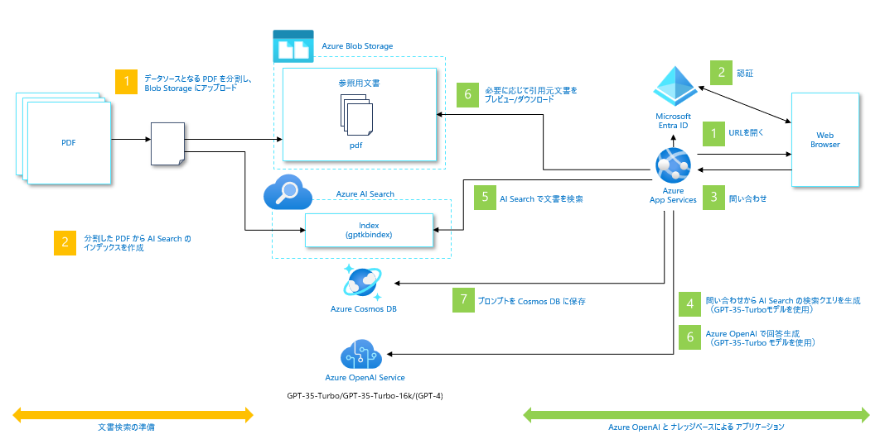

# Chat+社内文書検索

## 概要
このデモは、ChatGPT ライクなインターフェースを使用して企業の社内文書を検索するアプリケーションの実装パターンです。デモアプリを利用するためには、Azure Open AI の ChatGPT(gpt-35-turbo) モデルと、Azure Cognitive Search、他にいくつかのリソースの作成が必要です。

このリポジトリでは、サンプルデータに[厚生労働省のモデル就業規則](https://www.mhlw.go.jp/stf/seisakunitsuite/bunya/koyou_roudou/roudoukijun/zigyonushi/model/index.html)を使用しています。

デモアプリは以下のように動作します。

## Architecture

## UI

## セットアップガイド

> **重要:** このサンプルをデプロイするには、**Azure Open AI サービスが有効になっているサブスクリプションが必要です**。Azure Open AI サービスへのアクセス申請は[こちら](https://aka.ms/oaiapply)から行ってください。

### 事前準備

#### クラウド実行環境
このデモをデプロイすると以下のリソースが Azure サブスクリプション上に作成されます。
| サービス名 | SKU | Note |
| --- | --- | --- |
|Azure App Service|S1||
|Azure OpenAI Service|S0|gpt-3.5-turbo|
|Azure Cognitive Search|S1||
|Azure Cosmos DB|プロビジョニング済みスループット||
|Azure Form Recgonizer|S0||
|Azure Blob Storage|汎用v2|ZRS|

#### ローカル開発環境
このデモをデプロイするためには、ローカルに以下の開発環境が必要です。
> **重要** このサンプルは Windows もしくは Linux 環境で動作します。ただし、WSL2 の環境では正常に動作しません。
- [Azure Developer CLI](https://aka.ms/azure-dev/install) （version 1.0.2以降推奨）
- [Azure CLI](https://learn.microsoft.com/cli/azure/install-azure-cli) （version 2.50.0以降推奨）
- [Python 3+](https://www.python.org/downloads/)（version 3.11以降推奨）
    - **重要**: Windows 環境では、python および pip を Path 環境変数に含める必要があります。
    - **重要**: `python --version` で現在インストールされている Python のバージョンを確認することができます。 Ubuntu を使用している場合、`sudo apt install python-is-python3` で `python` と `python3` をリンクさせることができます。    
- [Node.js](https://nodejs.org/en/download/)（version 14.18以降推奨）
- [Git](https://git-scm.com/downloads)
- [Powershell 7+ (pwsh)](https://github.com/powershell/powershell) - Windows で実行する場合のみ
   - **重要**: `pwsh.exe` が PowerShell コマンドとして実行できることを確認して下さい。

>注意: 実行するユーザの AAD アカウントは、`Microsoft.Authorization/roleAssignments/write` 権限を持っている必要があります。この権限は [ユーザーアクセス管理者](https://learn.microsoft.com/azure/role-based-access-control/built-in-roles#user-access-administrator) もしくは [所有者](https://learn.microsoft.com/azure/role-based-access-control/built-in-roles#owner)が保持しています。  
`az role assignment list --assignee <your-Azure-email-address> --subscription <subscription-id> --output table`

### インストール

#### プロジェクトの初期化

1. このリポジトリをクローンし、フォルダをターミナルで開きます。(Windows の場合は pwsh ターミナルで実行する例です)
1. `azd auth login` を実行します。
1. `azd init` を実行します。
    * 現在、このサンプルは必要な Azure Open AI のモデルは該当モデルをサポートしている**米国東部**もしくは**米国中南部**リージョンにデプロイすることが可能です。最新の情報は[こちら](https://learn.microsoft.com/en-us/azure/cognitive-services/openai/concepts/models)を参考にしてください。

#### スクラッチでの開始

新規に環境をデプロイする場合は、以下のコマンドを実行してください。

1. `az login`と`az account set -s YOUR_SUBSCRIPTION_ID`後に、`az ad user show --id your_account@your_tenant -o tsv --query id` を実行して、操作をするユーザの AAD アカウントのオブジェクトID を取得します。
1. 取得したオブジェクトID を環境変数`AZURE_PRINCIPAL_ID`にセットします。
    - Windows 環境で実行している場合は、`$Env:AZURE_PRINCIPAL_ID="Your Object ID"`を実行します。
    - Linux 環境で実行している場合は、`export AZURE_PRINCIPAL_ID="Your Object ID"`を実行します。
1. `azd up` を実行します。- このコマンドを実行すると、Azure上に必要なリソースをデプロイし、アプリケーションのビルドとデプロイが実行されます。また、`./data`配下の PDF を利用して Search Index を作成します。
1. コマンドの実行が終了すると、アプリケーションにアクセスする為の URL が表示されます。この URL をブラウザで開き、サンプルアプリケーションの利用を開始してください。  

コマンド実行結果の例：

    
> 注意: アプリケーションのデプロイ完了には数分かかることがあります。"Python Developer" のウェルカムスクリーンが表示される場合は、数分待ってアクセスし直してください。

#### アプリケーションのローカル実行
アプリケーションをローカルで実行する場合には、以下のコマンドを実行してください。`azd up`で既に Azure 上にリソースがデプロイされていることを前提にしています。

1. `azd login` を実行する。
2. `src` フォルダに移動する。
3. `./start.ps1` もしくは `./start.sh` を実行します。

##### VS Codeでのデバッグ実行
1. `src\backend`フォルダに異動する
2. `code .`でVS Codeを開く
3. Run>Start Debugging または F5

#### FrontendのJavaScriptのデバッグ
1. src/frontend/vite.config.tsのbuildに`minify: false`を追加
2. ブラウザのDeveloper tools > Sourceでブレイクポイントを設定して実行

### GPT-4モデルの利用
2023年6月現在、GPT-4 モデルは申請することで利用可能な状態です。このサンプルは GPT-4 モデルのデプロイに対応していますが、GPT-4 モデルを利用する場合には、[こちら](https://learn.microsoft.com/ja-jp/azure/cognitive-services/openai/how-to/create-resource?pivots=web-portal#deploy-a-model)を参考に、GPT-4 モデルをデプロイしてください。また、GPT-4 モデルの利用申請は[こちらのフォーム](https://aka.ms/oai/get-gpt4)から可能です。

GPT-4 モデルのデプロイ後、以下の操作を実行してください。

1. このサンプルをデプロイした際に、プロジェクトのディレクトリに `./${環境名}/.env` ファイルが作成されています。このファイルを任意のエディタで開きます。
1. 以下の行を探して、デプロイした GPT-4 モデルのデプロイ名を指定してください。
> AZURE_OPENAI_GPT_4_DEPLOYMENT="" # GPT-4モデルのデプロイ名
AZURE_OPENAI_GPT_4_32K_DEPLOYMENT="" # GPT-4-32Kモデルのデプロイ名

1. `azd up` を実行します。

GPT-4 モデルは、チャット機能、文書検索機能のオプションで利用することができます。

### Easy Authの設定（オプション）
必要に応じて、Azure AD に対応した Easy Auth を設定します。Easy Auth を設定した場合、UI の右上にログインユーザのアカウント名が表示され、チャットの履歴ログにもアカウント名が記録されます。
Easy Auth の設定は、[こちら](https://learn.microsoft.com/ja-jp/azure/app-service/scenario-secure-app-authentication-app-service)を参考にしてください。
