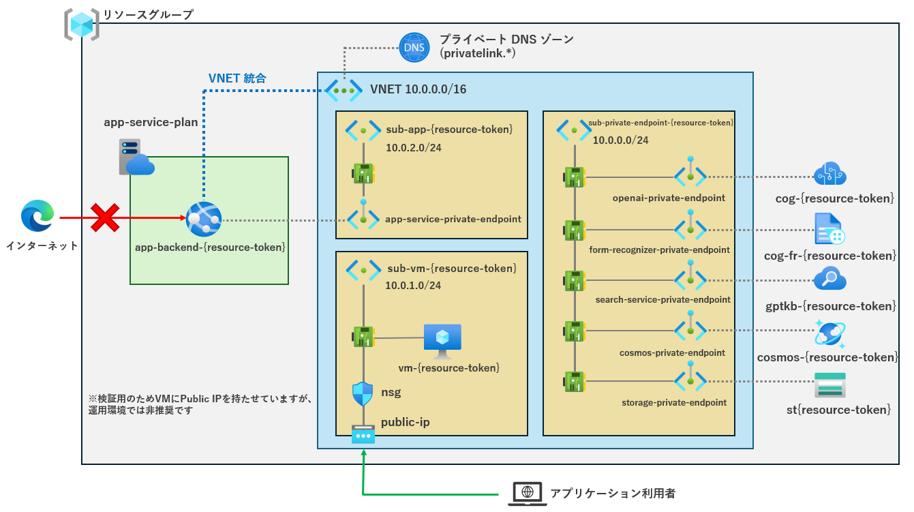
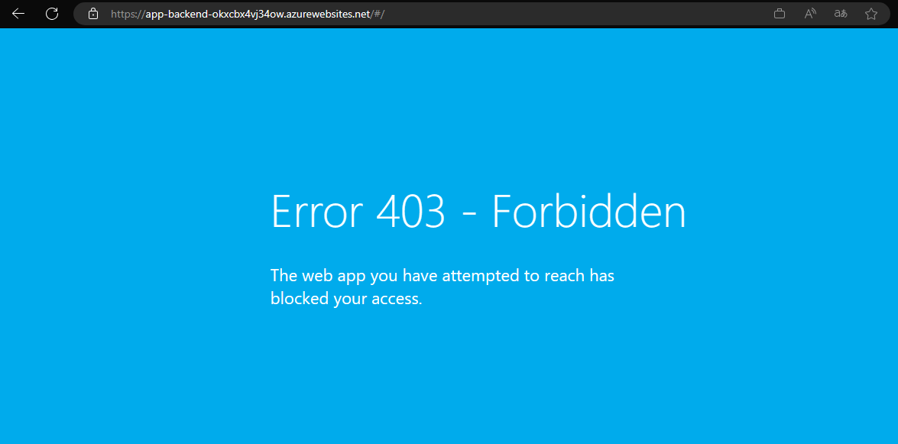

# 閉域網におけるデプロイ

#### アーキテクチャ



#### リソース追加・変更内容

- Virtual Machine
  - アプリクライアントへアクセス及びApp Serviceへのコードのデプロイを行うための環境としてVirtual Machineを配置しています。
- Private Endpoint
  - App Service, Cognitive Service, Azure OpenAI Service, Form Recognizer, Storage AccountをAzure内で通信させるために、プライベートエンドポイントを配置しています。
- Azure Virtual Network
  - インターネットアクセスから遮断するため、全てのリソースをVnet内に配置しています。
- Subnet
  - 仮想デスクトップ、App Service Environment、プライベートエンドポイント群の3つに対してそれぞれサブネットを配置しています。

IaCとして追加・更新したファイルは以下の通りです。

- ./infra/core/network/privateEndpoint.bicep
- ./infra/core/network/subnet.bicep
- ./infra/core/network/vnet.bicep
- ./infra/core/network/pip.bicep
- ./infra/core/network/nsg.bicep
- ./infra/core/network/nic.bicep
- ./infra/core/vm/vm.bicep
- ./infra/main.bicep


## セットアップガイド

> **重要:** このサンプルをデプロイするには、**Azure Open AI サービスが有効になっているサブスクリプションが必要です**。Azure Open AI サービスへのアクセス申請は[こちら](https://aka.ms/oaiapply)から行ってください。

### 事前準備

#### クラウド実行環境
このデモをデプロイすると以下のリソースが Azure サブスクリプション上に作成されます。
| サービス名 | SKU | Note |
| --- | --- | --- |
|Virtual Network||Private Endpoint用のSubnetを含む|
|Private Endpoint||App Service, Cognitive Service, Azure OpenAI Service, Form Recognizer, Storage Account用の5つ|
|NNetwork Interface||Private Endpoint用の5つ|
|Azure App Service|S1||
|Azure OpenAI Service|S0|gpt-3.5-turbo gpt-3.5-turbo-16k|
|Azure AI Search|S1||
|Azure Cosmos DB|プロビジョニング済みスループット||
|Azure Form Recognizer|S0||
|Azure Blob Storage|汎用v2|ZRS|
|Azure Application Insights||ワークスペース　ベース|
|Azure Log Analytics|||

## デプロイ手順
閉域網でのデプロイを実行するには、以下の手順でデプロイします。

1. `./infra/main.parameters.json`の`isPrivateEndpointEnabled`を`true`に設定します。

2. azd CLIを用いてリソースのデプロイの実行を行います。

```bash
azd up
```

3. デプロイ完了後、以下の各リソースを閉域網に変更します。

- Azure Cosmos DB
- Azure Storage Account
- Azure App Service
- Azure AI Search


4. デプロイされているApp Serviceの `既定のドメイン` をブラウザから開き、以下のようにアクセス制限がかかっていることを確認します。



5. リソースグループにデプロイされているVirtual Machine内に以下の認証情報を用いてremote desktop接続を行います。

```
接続先：Virtual MachineのパブリックIPアドレス
ユーザ名：azureuser
```

6. Virtual Machine内での中でブラウザを開き、App Serviceの `既定のドメイン` へのアクセスが可能なことを確認してください。

