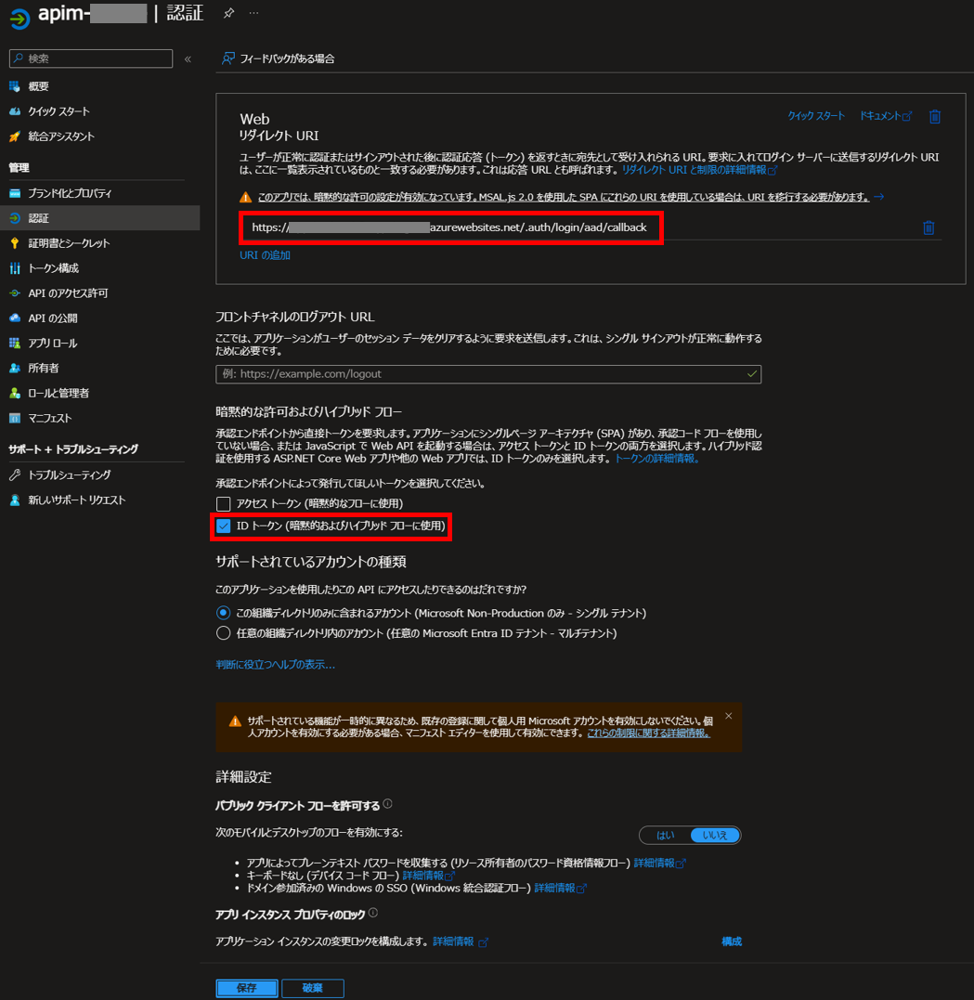
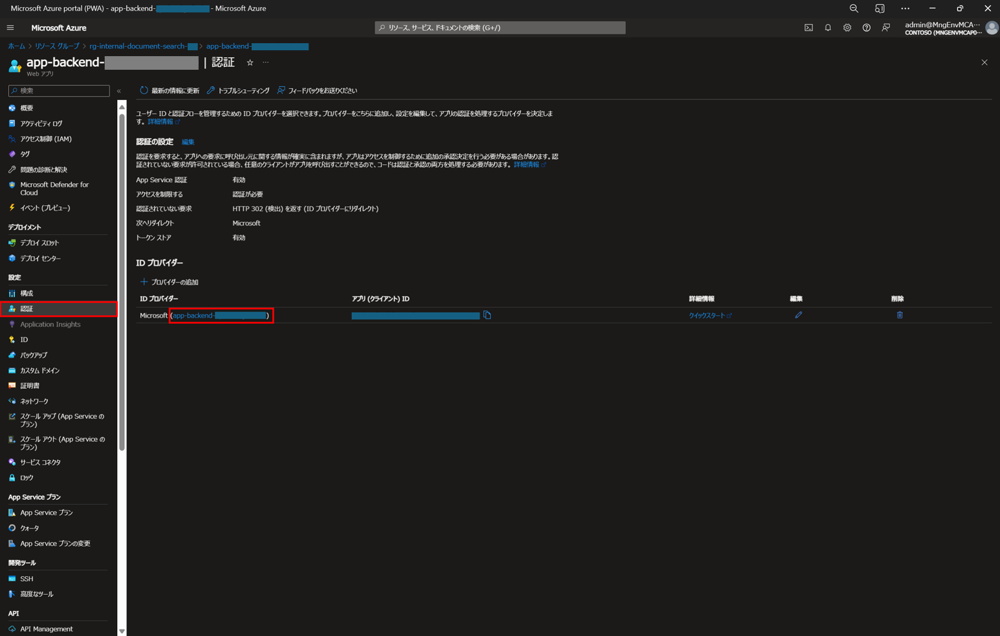
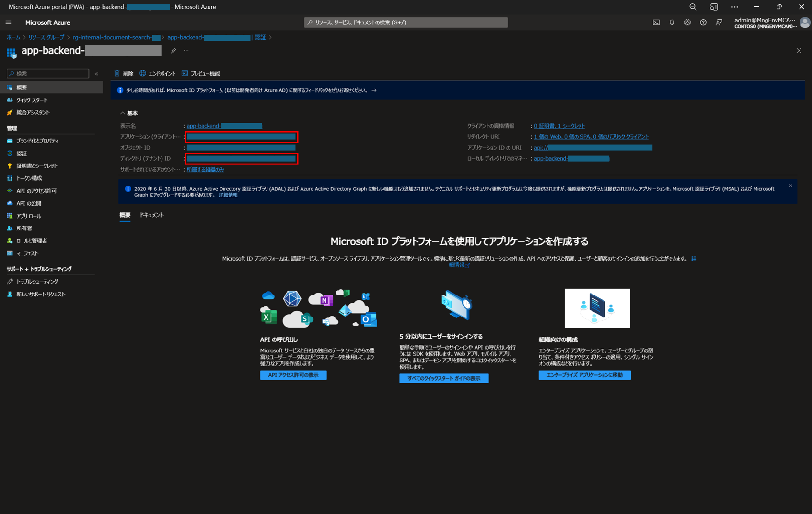
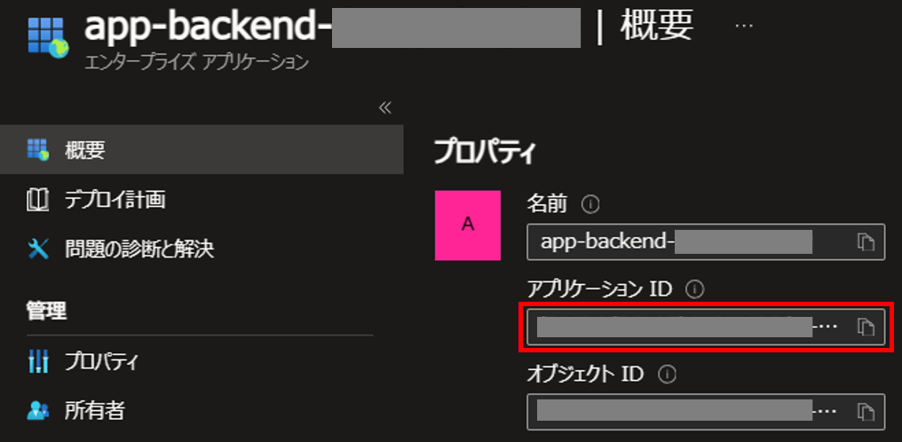
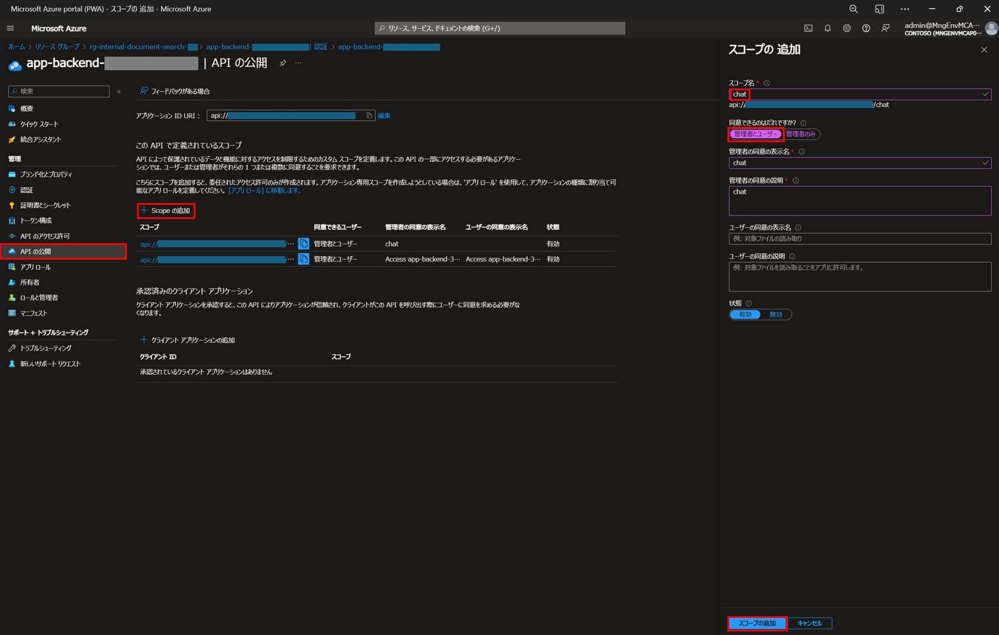
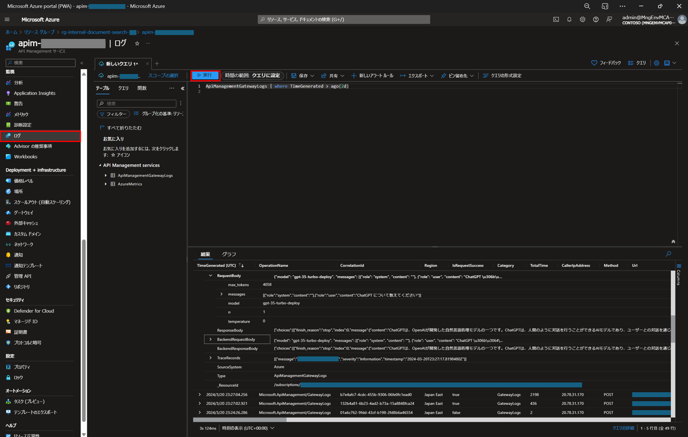

# API Management の利用

本ドキュメントは、リファレンスアーキテクチャ第 6 章の [6.azureopenai-landing-zone-accelerator](https://github.com/yus04/jp-azureopenai-samples/tree/main/6.azureopenai-landing-zone-accelerator) のリポジトリの内容を、Chat+社内文書検索の本サンプルに組み込むことを目的とした補足資料です。

## アーキテクチャ

## 事前準備
API Management を利用するために、以下ができている前提で説明をしていきます。
- 5 章のリファレンスアーキテクチャのサンプルアプリがデプロイ済み
- Easy Auth が設定済み ([Easy Auth の設定方法](https://learn.microsoft.com/ja-jp/azure/app-service/scenario-secure-app-authentication-app-service))

> Easy Auth の設定の際に、既存のアプリを登録する場合は Entra ID アプリの「認証」で以下のように設定してください。

## 利用手順
1. main.parameters.json の変更
1. API のスコープ追加
1. API Management のデプロイ

### main.parameters.json の変更

#### API Management の有効化
main.parameters.json にある以下の false の部分を true に書き変える。
> "useApiManagement": {
    "value": false
}

#### アプリケーション ID とテナント ID の登録
Azure ポータルからデプロイ済み App Service の画面から、「認証」>「ID プロバイダー」>「Microsoft (<アプリ名>)」を選択。

Entra ID に登録されているアプリの概要画面から、「アプリケーション (クライアント) ID」と「ディレクトリ (テナント) ID」をコピーする。

main.parameters.json の以下の xxxx の部分に対し、コピーした ID でそれぞれ置き換える。
> "audienceClientAppId": {
    "value": "xxxxxxxx-xxxx-xxxx-xxxx-xxxxxxxxxxxx"
},

> "tenantId": {
    "value": "xxxxxxxx-xxxx-xxxx-xxxx-xxxxxxxxxxxx"
},

#### サービスプリンシパルのアプリケーション ID の登録
Azure ポータルの検索窓から、App Service 名を入力して表示されるサービスプリンシパルを選択する。

概要に「アプリケーション ID」が表示されているので、コピーする。

main.parameters.json の以下の xxxx の部分に対し、コピーした ID で置き換える。

> "audienceWebAppId": {
    "value": "xxxxxxxx-xxxx-xxxx-xxxx-xxxxxxxxxxxx"
},

### API のスコープ追加
Entra ID に登録されているアプリ画面から、「API の公開」>「+ Scope の追加」を選択し、スコープ名を「chat」、同意できるのを「管理者とユーザー」とし、同意の表示名と説明を入力したあとスコープの追加を行う。

### API Management のデプロイ
`azd up` を実行する。

## API Management によるログの確認
上記の利用手順を踏むことで、Chat や 社内文書検索で Azure OpenAI Service にリクエストを送る際に、API Management が利用されるようになる。実際に利用されているかどうかを確認するために、API Management のログを確認する。Azure ポータルの画面の「ログ」で以下のコマンドを実行した実行結果から、リクエストの送信時間、ユーザープロンプト、Azure OpenAI Service からの回答、等の情報が出力されていることが確認できる。

> ApiManagementGatewayLogs | where TimeGenerated > ago(2d)

> **注意事項１**：[Azure API Management の従量課金レベルでは rate-limit-by-key と quota-by-key のポリシーが使用できないため](https://learn.microsoft.com/ja-jp/azure/api-management/api-management-sample-flexible-throttling#custom-key-based-throttling) SKU は従量課金プランではなく Standard でデプロイしています。

> **注意事項２**：Standard プランのデプロイには約 40 分かかります。

