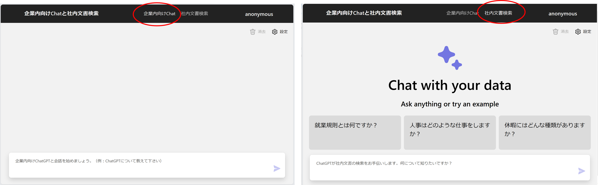

# Chat+社内文書検索 ワークショップ

このワークショップは [Azure OpenAi Service リファレンスアーキテクチャ](https://www.microsoft.com/ja-jp/events/azurebase/contents/default.aspx?pg=AzureOAIS) ５章 - 企業内向けChatと社内文書検索 の内容と、
その[サンプルコード](https://github.com/Azure-Samples/jp-azureopenai-samples) を元に作成されています。

## 概要

社内文書など通常の OpenAI では学習されていない情報をもとに適切な回答を作成するチャットシステム の作成を通して、
Azure OpenAI Service や Azure Cognitive Search などの使い方、
チャットシステムを社内に展開するための Web アプリケーションの作成の基礎を学びます。

このワークショップの特徴は次の2つです。

- 専門用語や業界独自のナレッジを検索できる
    - ChatGPT(gpt-35-turbo)モデルでトレーニングされたデータに基づいてテキストを生成しません
    - ChatGPTのトレーニングに使用されていない、企業内に閉じたデータや最新のデータをもとに生成します
- 回答の根拠を明確にする
    - ChatGPTの回答に「引用」をテキストに付加することで信頼できる応答を生成します

## 対象者

このワークショップは、AI技術に興味のあるデータサイエンティスト、エンジニア、研究者、または企業内での情報アクセスやナレッジ共有の改善を目指す方々に適しています。

## 参考資料

- [ChatGPT + Enterprise data with Azure OpenAI and Cognitive Search](https://github.com/nohanaga/azure-search-openai-demo)
- [Azure で ChatGPT × Cognitive Search を使ったエンタープライズサーチを実現](https://qiita.com/nohanaga/items/803c09b5a3a4e2d1776f)
- [Azure OpenAI Developers セミナー](https://www.youtube.com/watch?v=tFgqdHKsOME)
- [『ChatGPTによって描かれる未来とAI開発の変遷』日本マイクロソフト株式会社 蒲生 弘郷氏](https://www.youtube.com/watch?v=l9fpxtz22JU)
- [Revolutionize your Enterprise Data with ChatGPT: Next-gen Apps w/ Azure OpenAI and Cognitive Search](https://aka.ms/entgptsearchblog)
- [Azure Cognitive Search](https://learn.microsoft.com/azure/search/search-what-is-azure-search)
- [Azure OpenAI Service](https://learn.microsoft.com/azure/cognitive-services/openai/overview)

## 留意事項

本ワークショップは 2023 年 8 月現在での情報を元に作成しています。
Azure および Azure OpenAI Service の関連技術は変化が激しく、本ワークショップの内容は古くなっている可能性があることに注意してください。

!> 本ワークショップで解説しているサンプルコードは Azure OpenAI Service の gpt-35-turbo (0301) モデルに対する ChatML を使用した Completion API を使用しています。
この方式は現時点においてもプレビュー段階であり、最新の GPT-4 では利用できませんので、今後動作しなくなる可能性があります。
詳細は [GPT-35-Turbo と GPT-4 - ChatML](https://learn.microsoft.com/ja-jp/azure/ai-services/openai/how-to/chatgpt?pivots=programming-language-chat-ml)をご参照ください。

