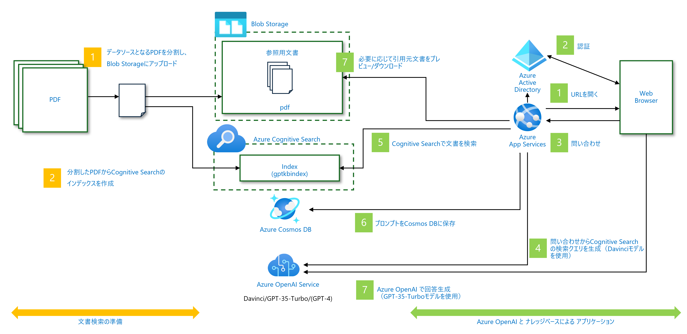
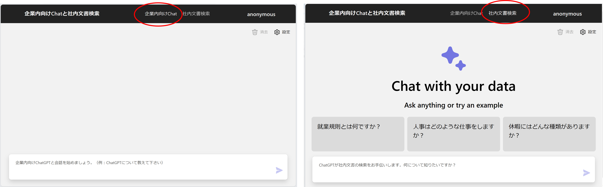
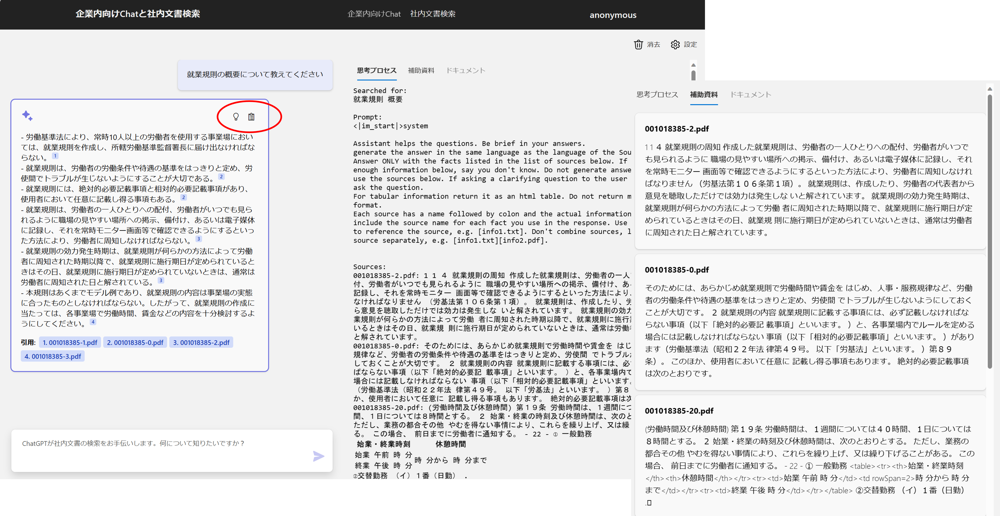
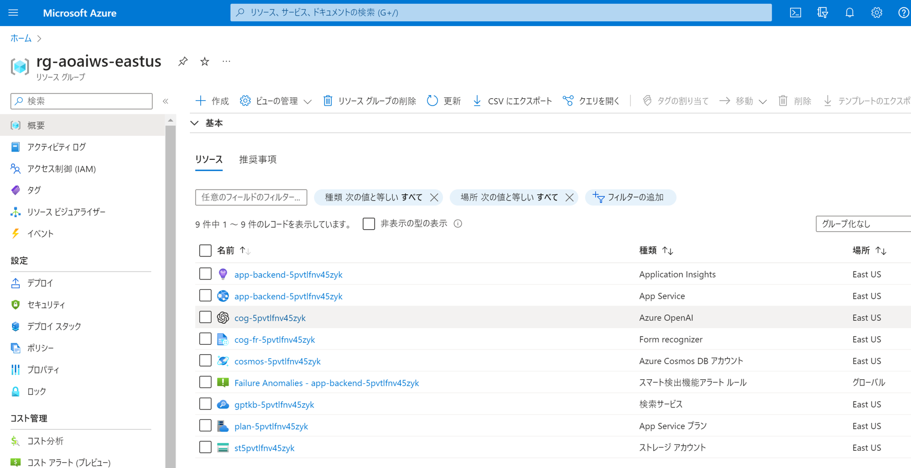
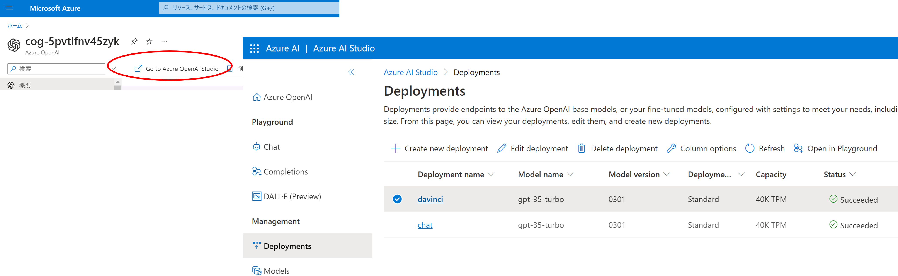
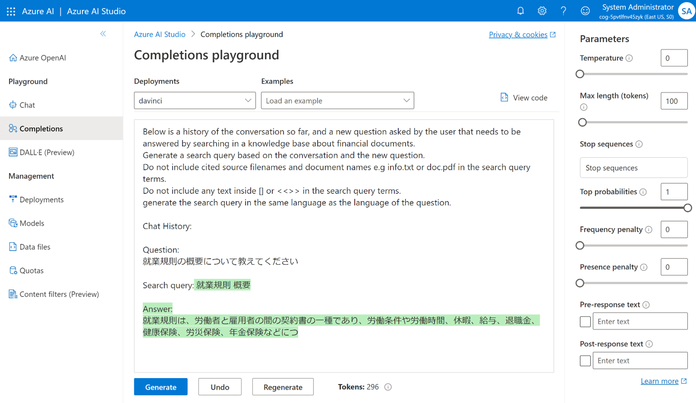
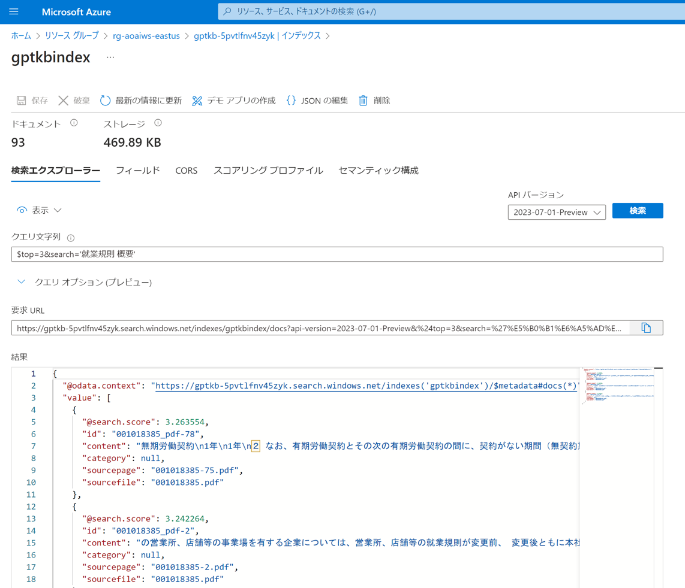
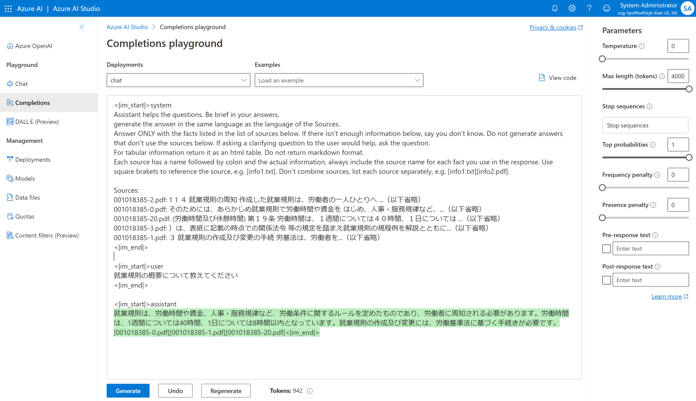
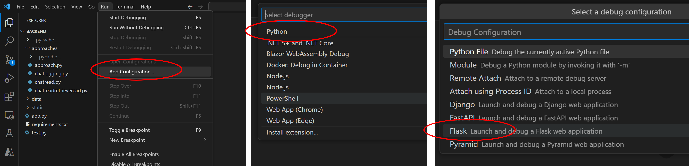
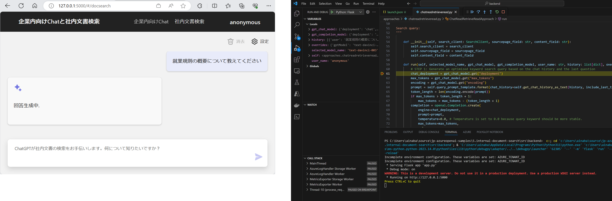

# Module 0 : Windows 実行環境の確認とインストール

## Azure CLI

Azure CLI version 2.50.0 以降が推奨です。
以下のコマンドでバージョンを確認してください。

```pwsh
az --version
```
```pwsh
# 出力結果の例
azure-cli                         2.49.0 *
```

バージョンが古い場合は、以下のコマンドでアップデートしてください。

```pwsh
az upgrade
```

インストールされていない場合は、以下のコマンドでインストールしてください。

```pwsh
winget install Microsoft.AzureCLI
```

## Azure Developer CLI

Azure Developer CLI version 1.0.2 以降が推奨です。
以下のコマンドでバージョンを確認してください。

```pwsh
azd version
```
```pwsh
# 出力結果の例
azd version 1.2.0 (commit 99ea7577f0df0df2ba34b677da189fafba18c0f7)
```

インストールされていない場合は、以下のコマンドでインストールしてください。

```pwsh
winget install Microsoft.Azd
```

## Python 3

Python version 3.11 以降が推奨です。
以下のコマンドでバージョンを確認してください。

```pwsh
python --version
```
```pwsh
# 出力結果の例
Python 3.11.4
```

インストールされていない場合は、以下のコマンドでインストールしてください。

```pwsh
winget install Python.Python.3.11 
```
https://learn.microsoft.com/ja-jp/windows/python/beginners

## Node.js

Node.js version 14.18 以降が推奨です。
以下のコマンドでバージョンを確認してください。

```pwsh
node --version
```
```pwsh
# 出力結果の例
v18.16.1
```

## Git

Git のバージョンは以下で確認できます。

```pwsh
git --version
```
```pwsh
# 出力結果の例
git version 2.41.0.windows.3
```

インストールされていない場合は、以下のコマンドでインストールしてください。

```pwsh
winget install Git.Git
```

## PowerShell (pwsh)

PowerShell version 7 以降が推奨です。
以下のコマンドでバージョンを確認してください。

```pwsh
pwsh --version
```
```pwsh
# 出力結果の例
PowerShell 7.3.6
```

インストールされていない場合は、以下のコマンドでインストールしてください。

```pwsh
winget install Microsoft.PowerShell
```

## Visual Studio Code

インストールされている Visual Studio Code のバージョンを確認します。

```pwsh
code --version
```
```pwsh
# 出力結果の例
1.81.1
6c3e3dba23e8fadc360aed75ce363ba185c49794
x64
```

インストールされていない場合は、以下のコマンドでインストールしてください。

```pwsh
winget install Microsoft.VisualStudioCode
```


# Module 1 : サンプルコードのセットアップ

## サンプルコードの取得

このリポジトリをクローンします。

```pwsh
git clone https://github.com/ayuina/jp-azureopenai-samples.git
```

`Chat+社内文書検索` のサンプルを含むディレクトリを Visual Studio Code で開きます

```pwsh
code .\jp-azureopenai-samples\5.internal-document-search\
```

以降のコマンドは Visual Studio Code の pwsh ターミナルで実行してください。

## 開発者の認証と Azure サブスクリプションの指定

pwsh ターミナルを使用して Azure CLI でサインインを行います。
Azure OpenAI サービスを有効化済みの Azure サブスクリプションに対してアクセス権を持つユーザーでサインインしてください。

```pwsh
az login
```

アクセス可能なサブスクリプションの一覧を取得し、利用するサブスクリプションの `SubscriptionId` コピーします。

```pwsh
az account list --output table
```
```pwsh
# 出力結果の例
Name                          CloudName    SubscriptionId                        TenantId                              State    IsDefault
----------------------------  -----------  ------------------------------------  ------------------------------------  -------  -----------
Subscription Name             AzureCloud   aaaaaaaa-bbbb-cccc-dddddddddddd       pppppppp-qqqq-rrrr-ssssssssssss       Enabled  True
```

サブスクリプション ID を変数に格納し、既定のサブスクリプションとして指定しておきます。
複数のサブスクリプションが表示されていた場合は、ワークショップに使用する適切なサブスクリプションを選択してください。

```pwsh
$subscid = 'aaaaaaaa-bbbb-cccc-dddddddddddd'
az account set -s $subscid
```

Azure CLI でサインインしたユーザーの ObjectID を変数に格納しておきます。

```pwsh
az ad signed-in-user show --query id --output tsv | sv userobjid
echo $userobjid
```
```pwsh
# 出力結果の例
wwwwwwww-xxxx-yyyy-zzzzzzzzzzzz
```

## 開発者向けの環境構築

Azure Developer CLI でサインインを行います。
ここでは先ほど Azure CLI でのサインインと同じユーザーを使用してください。

```pwsh
azd auth login
```

環境を初期化します。
- サブスクリプションは先ほど取得したものを使用します。
- デプロイ先の Azure リージョンは [gpt-35-turbo(0301) モデルが利用可能](https://learn.microsoft.com/ja-jp/azure/ai-services/openai/concepts/models#gpt-35-models)な下記から選択します。
    - `eastus` : 米国東部リージョン
    - `uksouth` : 英国南部リージョン
    - `westeurope` : 西ヨーロッパリージョン
- 環境名は任意の名前を付けられますが、同一サブスクリプションを共有している場合は名前が衝突しないように注意してください

```pwsh
azd init --subscription $subscid --location eastus --environment aoai-workshop   
```

コマンドの実行後に Visual Studio Code Explorer ペインで `.azure` ディレクトリが作成されていることを確認してください。
そのサブディレクトリには指定した環境名のディレクトリと `.env` ファイルが生成され、 `.env` ファイルにはこれまで指定した各種パラメータが記載されていることを確認します。
この `.azure` ディレクトリは `.gitignore` で指定されているため、その他のソースコードと一緒に共有はされず、操作をしている開発者固有の環境となります。

先ほど変数に控えておいた開発者ユーザーアカウントの ObjectID も `AZURE_PRINCIPAL_ID` として `.env` ファイルに追記しておきます。
```pwsh
azd env set AZURE_PRINCIPAL_ID $userobjid
```

指定した Azure サブスクリプションに対して環境を構築します。
```pwsh
azd up
```

この処理にはおおむね60分程度かかりますので、待っている間にリポジトリに含まれる各ファイルを確認しておくとよいでしょう。

## 複数の環境を使い分けたい場合

Azure Developer CLI では複数の環境を管理し使い分けることができます。
前述の `azd init` で作成した環境が既定値に設定されているため、各コマンドでは明示的に `--environment` オプションを使用して環境名を指定します。

```pwsh
# 利用するリージョンを環境名に含める（リソースグループやリソース名に反映される）
$region = 'francecentral'
$envname = "aoaiws-${region}"

# 同じサブスクリプションで異なるリージョンを利用したい場合
azd env new $envname --subscription $subscid --location $region
azd env set AZURE_PRINCIPAL_ID $userobjid --environment $envname

# 環境構築
azd up --environment $envname
```

上記の `azd env new` コマンドを実行すると `.azure` 配下に環境名のディレクトリが作成され、各環境固有の .env ファイルが作成されます。
環境名に分かりやすい名前を指定し `.env` ファイルの記載内容によって環境固有のパラメータを切り替えていくとよいでしょう。


# Module 2 : 構築結果とアプリケーションの動作確認

`azd up` が正常に完了したら構築された環境やアプリケーションを、アーキテクチャ図と比較しながら確認していきます。



## アプリの動作確認

まずは出来上がってるアプリケーションの動作を確認してみましょう。
前述のアーキテクチャ図の `1. URLを開く` および `3. 問い合わせ`の部分に該当します。
なおここでは認証設定を行っていませんので、 `2. 認証` の部分はスキップします。

ターミナルには `azd up` の出力の最後の方で、以下のような出力が確認できるはずです。

```pwsh
Section ends with unclosed table, starting next section with the table at page 53 offset 53083 table start 848
Section ends with unclosed table, starting next section with the table at page 71 offset 69609 table start 1122
        Indexed 93 sections, 93 succeeded

Deploying services (azd deploy)

  (✓) Done: Deploying service backend
  - Endpoint: https://app-backend-xxxxxxxxxxxx.azurewebsites.net/

SUCCESS: Your application was provisioned and deployed to Azure in 19 minutes 15 seconds.
You can view the resources created under the resource group rg-aoaiws-eastus in Azure Portal:
https://portal.azure.com/#@/resource/subscriptions/aaaaaaaa-bbbb-cccc-dddddddddddd/resourceGroups/rg-your-envname/overview
```

`Endpoint` として表示されている `.azurewebsites.net` ドメインの URL がサンプルアプリケーションのエンドポイントになっています。
こちらをブラウザで開いて動作を確認してみましょう。




- 企業内向け Chat : Azure OpenAI Service と直接チャットするための画面です
- 社内文書検索 : `data` ディレクトリに格納されている PDF ファイルの内容に基づいて内容をチャットするための画面です

上部のメニューで `社内文書検索` を選択して話しかけると、回答とともに思考プロセスや補助資料が確認できます。




## 構築された Azure 環境の確認

自動的に構築された Azure リソースを確認してみましょう。
先ほどのターミナル出力の最後に `You can view the resources created under the resource group rg-aoaiws-eastus in Azure Portal:` というメッセージとともに URL が表示されています。
こちらをブラウザで開くことで `azd up` で構築された実際の Azure リソースを確認できます。
認証を求められた場合には `az login` や `azd auth login` の実行時に使用したユーザーでサインインしてください。



これらのリソースは Bicep テンプレートを使用してデプロイされています。
`infra` ディレクトリに格納されている `main.bicep` 等のファイルがその実体になります。
こちらも併せて中身を確認してみてください。

## 言語モデルを使用した検索クエリの生成

この `社内文書検索` では、まず初めに `4. 問い合わせからCognitive Search の検索クエリを生成` を行っています。
なお画像では `Davinci モデルを使用` との記載がありますが、現在こちらは gpt-35-turbo (0301) モデルを使用しています。
このバージョンのモデルは Davinci モデルと同様に [Completions API](https://learn.microsoft.com/ja-jp/azure/ai-services/openai/how-to/completions)に対応しているため、互換性があります。

Azure OpenAI に対してクエリを生成させるためのプロンプトのテンプレートおよび処理内容が `src/backend/approaches/chatreadretrieveread.py` に実装されています。

```python
# プロンプト部分のテンプレート
query_prompt_template = """Below is a history of the conversation so far, and a new question asked by the user that needs to be answered by searching in a knowledge base about financial documents.
Generate a search query based on the conversation and the new question. 
Do not include cited source filenames and document names e.g info.txt or doc.pdf in the search query terms.
Do not include any text inside [] or <<>> in the search query terms.
generate the search query in the same language as the language of the question.

Chat History:
{chat_history}

Question:
{question}

Search query:
"""
```

どのような結果が生成されるか試してみましょう。

Azure Portal から Azure OpenAI サービスを選択し、`Go to Azure OpenAI Studio` を選択します。
Azure OpenAI Studio 左側にある `Deployments` メニューを開くと、デプロイされたモデルの一覧が表示されます。
名前が紛らわしいですが `davinci` と `chat` という名前の 2 つの gpt-35-turbo(0301) モデルがデプロイされていることが分かります。



Azure OpenAI Studio 左側にある `Completions` メニューを開き、`davinci` という名前の Deployments を選択します。
先ほどのプロンプトの `Question` を質問文に書き換えて `Generate` を実行します。



この質問文 `就業規則の概要について教えてください` に対する参考情報を検索するためのクエリとしては `就業規則` `概要` がよさそうです。

## 検索エンジンによる参考情報の検索

次に `5. Cognitive Search で文書を検索` を確認します。
Azure Portal に戻り Azure Congitive Search を選択します。
左側にある `インデックス` メニューを選択すると、`gptkbindex` という名前のインデックスがすでに作成されていることが分かります。
このインデックスを開くと実際に検索を試すことが出来ますので、先ほどのクエリを入力して検索してみましょう。
キーワードそのままだと大量の結果が返ってきますので、ここでは上位３件に絞っています。



このインデックスは `azd up` 実行時に `azure.yaml` ファイルで定義された `postprovision` 処理として下記が実行され生成されたものです。

1. データソースとなるPDFを分割し、Blob Storageにアップロード
1. 分割したPDFからCognitive Searchのインデックスを作成

## 検索結果と言語モデルを使用して最終的な回答を生成する

得られた検索結果を元に `7. Azure OpenAI で回答生成` を確認します。
このサンプルでは [ChatML というマークアップ言語](https://learn.microsoft.com/ja-jp/azure/ai-services/openai/how-to/chatgpt?pivots=programming-language-chat-ml) を用いてプロンプトを構成していますので、
その方法に倣ってプロンプトを作っていきます。

まずシステムプロンプトおよび ChatML のテンプレートが `src/backend/approaches/chatreadretrieveread.py` に実装されています。

```python
prompt_prefix_davinci = """<|im_start|>system
{system_prompt}

Sources:
{sources}

<|im_end|>
{chat_history}
"""

system_prompt = """
Assistant helps the questions. Be brief in your answers.
generate the answer in the same language as the language of the Sources.
Answer ONLY with the facts listed in the list of sources below. If there isn't enough information below, say you don't know. Do not generate answers that don't use the sources below. If asking a clarifying question to the user would help, ask the question.
For tabular information return it as an html table. Do not return markdown format.
Each source has a name followed by colon and the actual information, always include the source name for each fact you use in the response. Use square brakets to reference the source, e.g. [info1.txt]. Don't combine sources, list each source separately, e.g. [info1.txt][info2.pdf].
"""
```

システムメッセージ内の Source の部分には検索結果から得られた参照情報を記載します。
今はチャット履歴がありませんのでそこは飛ばしてしまって、上記の後にユーザーメッセージとして最初の質問文を続け、最後にアシスタンスメッセージを促すプロンプトを作成します。
これを Azure OpenAI Studio の Playground で試してみましょう。



## チャット履歴の確認


## 社内文書と文字認識


# Module 3 : アプリとデータのカスタマイズ

使用するデータやプロンプトを調整してサンプルをカスタマイズしていきます。

## 開発端末ローカルでのアプリ実行とデバッグの準備

この後の作業を進める上では、まずは開発端末上でアプリケーションをデバッグ実行できると便利です。
バックエンドアプリケーションのソースコードは `src/backend` ディレクトリに格納されているため、こちらを Visual Studio Code で開きます。

```pwsh
code .\src\backend\
```

新しく開いた Visual Studio Code のウィンドウでデバッグ実行するための構成を行います。
- `Run` メニューから `Add Configuration...` を選択します
- `Select Debugger` で `Python` を選択します
    - ここで `Python` が表示されない場合には `Install extension...` を選択して Python 拡張機能をインストールしてください
- `Debug Configuration` として `Flask` を選択します
- `.vscode/launch.json` ファイルが追加されます



このままでは Azure OpenAI Service や Azure Cognitive Search サービスに接続するためのエンドポイント情報が分からないため、アプリが実行時に読み込める環境変数を設定する必要があります。
これらの値は `azd up` 時に生成された環境固有の `.env` ファイルが使用できるので、`launch.json` の `envFile` 要素で参照します。
環境名部分はご自身の値に書き換えてください。

```json
{
    "version": "0.2.0",
    "configurations": [
        {
            //下記を追記（既存要素は省略してあります）
            "envFile": "${workspaceFolder}/../../.azure/azd-environment-name/.env"
        }
    ]
}
```

設定が完了したら以下の手順でローカル実行およびデバッグを行います。

- 処理を止めたい箇所にブレークポイントを設置
- `Run` メニューから `Start Debugging` を選択
- ターミナルに表示される URL をブラウザで開く
- 画面から処理を実行してブレークポイントで処理が止まることを確認



## 社内文書の変更

まずはベースとなる社内文書を変更してみましょう。

## プロンプトの調整


## 環境へのデプロイ