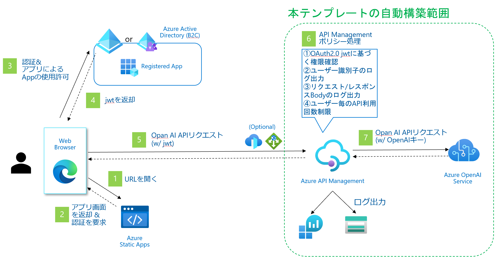

# このリポジトリの目的と構成

本リポジトリの構成は組織で安全にAzure OpenAI APIを利用できるようにすることを目的としています。
このリポジトリの適用でできるようになることは以下の通りです。

* アプリケーション利用前の認証/認可
* リクエスト/レスポンスBodyを含めたログの取得
* ユーザー毎、IP毎など柔軟な単位での利用量制限（クォータ制限）


構成は以下の通りです。




# 利用の前提

## Azure Developer CLIのインストール

https://learn.microsoft.com/ja-jp/azure/developer/azure-developer-cli/install-azd

等の手順に則り、Azure Developer CLIをインストールし利用できる状態にします。

## Azure OpenAIを使えること

Azure OpenAIの利用申請を行い、Azure OpenAIがサブスクリプションで作成できるようになっていることが必要です。

## Azure ADへのアプリの登録

認証を行う登録アプリとスコープをAzure ADに作成してください。この操作を行うためにはAzure AD（もしくはAzure AD B2C）の管理権が必要です。管理権のあるAzure ADがない場合にはリソースとして作成してから実施してください。

具体的には以下のような手順となります。

1. Azure ADの「アプリの登録」からアプリを登録します。名前を適当に指定し、「サポートされているアカウントの種類」として「この組織のディレクトリのみに含まれるアカウント」を選択。リダイレクトURIは利用するアプリが決まっている場合にそれを指定してください。（後述の連携アプリサンプルを用いる場合には ``http://localhost:3000`` を指定してください）

2. 作成されたアプリの「APIの公開」を選択し、スコープを追加します。スコープ名に適当な値（以下の例では「chat」とします）を指定し、同意できるのは「管理者とユーザー」、その他の項目は適宜投入し「スコープの追加」を押下します

* Azure ADのテナントID (UUID)
* 登録アプリのID (UUID)
* スコープ名 (例: api://(登録アプリID)/chat なら「chat」)

の3つの値を後で用いるためメモしてください。

# 利用手順

## 1. 本リポジトリのダウンロード

本リポジトリを ``git clone`` またはzipダウンロードして展開してください。

## 2. パラメータの設定

デプロイに必要なパラメータはすべて``infra/main.parameters.json`` に集約されています。

``infra/main.parameters.json`` の内容を以下のように編集してください。

| パラメータ名 | 投入する値 | 値の例 |
|--|--|--|
|environmentName|デプロイ時に指定するため編集不要です|-|
|location|デプロイ時に指定するため編集不要です|-|
|corsOriginUrl|認証を行うシングルページアプリ（SPA）のドメインを指定します。シングルページアプリケーションのドメインが確定していない場合、デフォルトの"*"を指定することも可能ですが、確定次第具体的なドメインを指定することをおすすめします |*, example.com, yourapp.azurewebsites.net など|
|audienceAppId|JWTを取得する対象となる登録アプリの登録アプリID|登録アプリID(UUID)|
|scopeName|スコープ名|chat|
|tenantId|認証対象となるAzure ADのテナントID|Azure ADのテナントID (UUID)|

## 3. Azure Developer CLIのログイン

以下のコマンドを用いてデプロイする対象となるサブスクリプションの属するAzure ADテナントにログインします
```bash
azd auth login
```

ブラウザのない環境の場合、

```bash
azd auth login --use-device-code
```

テナントを明示的に指定したい場合には

```bash
azd auth login --tenant-id
```
を指定してください。

## 4. デプロイの実行

以下のコマンドを実行します
```bash
azd up
```

以下の内容が聞かれるのでそれぞれ設定します

* 環境名: 任意の環境名を指定。rg-(環境名)というリソースグループが作成されます
* サブスクリプションの選択: リソースグループを作成するサブスクリプションを選択します
* ロケーションの選択: EastUSなどAzure OpenAIをサポートします

デプロイの完了までに10分ほど要します

指定した環境名等は ``.azure`` ディレクトリ配下に保存されているため、再度指定は不要です。環境を再定義しゼロから作成しなおしたい場合には .azure ディレクトリを削除等してください

# 動作確認

## 認証・リクエストの確認

### アプリからの接続/認証/リクエスト

* APIリクエストのエンドポイントを以下のように設定してください。リクエスト先のURL例は以下のようになります

```bash
https://YOURAPIMDOMAIN.azure-api.net/api/deployments/OPEN_AI_MODEL_NAME/chat/completions?api-version=APIVERSION
```

* ご利用されるアプリで登録したスコープ(上記例では ``api://アプリID/chat`` )を対象としてOAuth2(OIDC)認証認可を行いJWTを取得し、``Authorization: Bearer (JWT)``という
という形式でヘッダに付与し、APIリクエストを行ってください。
  * App ServiceのEasy Authを使って認証を行う場合にはフロントエンドで  ``.auth/me`` にアクセスして取得できる ``X-MS-TOKEN-AAD-ACCESS-TOKEN`` がこのJWTに相当します）詳細は以下のリンクを参照してください。
https://learn.microsoft.com/ja-jp/azure/app-service/configure-authentication-oauth-tokens


* また、既定ではAPI Managementのサブスクリプションキーの検証も有効になっているため、API Managment の「サブスクリプション」メニューで確認できるサブスクリプションキーを'Ocp-Apim-Subscription-Key' ヘッダに指定してください。

## ログ出力の確認

リクエストしたログはLog Analytics Workspace / Storage Accountの両方に保存されています

* Log Analytics Workspaceの確認: API Managementインスタンスの詳細画面 > ログ から確認可能です。例えば以下のようなKQLを発行することで直近3日間のログを取得できます。リクエストBody、レスポンスBody、（BackendRequestHeader内に)ユーザーIDなどが含まれていることをご確認ください
    ```
    ApiManagementGatewayLogs | where TimeGenerated > ago(2d)
    ```
* Storage Accountの確認: リソースグループ内のストレージアカウントの``insights-logs-gatewaylogs``コンテナにログが保存されます

# 第1~5章アプリとの接続

第1~5章のアプリと接続を行う場合以下の3点の設定変更（もしくはアプリの改修）を行ってください。

1. エンドポイントをAzure OpenAIからAPI Managementに変更する
1. リクエストヘッダにAPI Managementのサブスクリプションキーを付与する
1. リクエストヘッダにOAuth 2.0 JWTを付与する

それぞれの方法の詳細は前章の「アプリからの接続/認証/リクエスト」を参照してください。

# その他のTips

## ユーザーQuotaの変更

デフォルトでは各ユーザー 86400秒 (一日) あたり300回までのAPIリクエストを許容する設定になっています。回数・期間の変更を行いたい場合には``infra/app/apim-api-policy-aad.xml``の``quota-by-key``ポリシーの値を変更して再デプロイを行ってください

## Azure OpenAIの性能上限設定

上記のQuotaは「ユーザー毎」の利用回数を組織として制限する設定でしたが、
Azure OpenAIでは各モデルごとにリクエスト回数の上限設定が別途設けられています。上限を変更するためにはデプロイ後にAzure OpenAIの「モデルとデプロイ」＞「管理」＞Quotas から上限を変更するか、 ``main.parameters.json`` の ``aoaiCapacity`` パラメータで設定を変更してデプロイを行ってください。
ここで設定した数値はToken Per Minute（分あたりToken数x1000）を示します。10と設定されていた場合、1分間に10000トークンまで処理できるという意味合いになります。
現在、Azure OpenAIではサブスクリプション毎に各モデルで設定できる値に上限が設けられており、上限変更には申請が必要です。

## Azure AD以外のOAuthサーバによる認証

``apim-api.bicep`` ファイルにおいて ``apim-api-policy-aad.xml`` 読み込んでいる部分を ``apim-api-policy.xml`` に差し替えて再デプロイしてください。Azure AD専用の ``validate-azure-ad-token`` ポリシーではなくOAuth2汎用の ``validate-jwt`` ポリシーを用いる設定になっています。

## API Managementによるラウンドロビン

以下のようなpolicyを設定することで複数のAzure OpenAIインスタンスに対してリクエストをラウンドロビンで振り分けることが可能です。（Azure OpenAIのAPIは今のところステートレスで persistence が必要ないためステートフルなロードバランサー類が無くても成立します）

```xml
        <set-variable name="urlId" value="@(new Random(context.RequestId.GetHashCode()).Next(1, 101))" />
        <choose>
            <when condition="@(context.Variables.GetValueOrDefault<int>("urlId") < 51)">
                <set-backend-service base-url="{{backend-url-1}}" />
            </when>
            <when condition="@(context.Variables.GetValueOrDefault<int>("urlId") > 50)">
                <set-backend-service base-url="{{backend-url-2}}" />
            </when>
            <otherwise>
                <return-response>
                    <set-status code="500" reason="InternalServerError" />
                    <set-header name="Microsoft-Azure-Api-Management-Correlation-Id" exists-action="override">
                        <value>@{return Guid.NewGuid().ToString();}</value>
                    </set-header>
                    <set-body>A gateway-related error occurred while processing the request.</set-body>
                </return-response>
            </otherwise>
        </choose>
```
 * backend-url-1, backend-url-2にそれぞれAzure OpenAIのエンドポイントを設定してください
 * 両方のAzure OpenAIに対してAPI ManagementのManaged Idが ``Cognitive Services OpenAI User`` 以上のロールを持っていることをご確認ください