# Chat+社内文書検索 ワークショップ

## Module 1 : 実行環境の構築

Azure の各種サービスのデプロイとサンプルコードのデプロイを行います。
各種コマンド実行は Visual Studio Code ターミナルを使用してください。

###  開発者の認証と Azure サブスクリプションの指定

まず Azure CLI でサインインを行います。
Azure OpenAI サービスを有効化済みの Azure サブスクリプションに対してアクセス権を持つユーザーでサインインしてください。

```powershell, bash
az login
```

アクセス可能なサブスクリプションの一覧を取得し、利用するサブスクリプションの `SubscriptionId` コピーします。

```powershell, bash
az account list --output table
```
```powershell, bash
# 出力結果の例
Name                          CloudName    SubscriptionId                        TenantId                              State    IsDefault
----------------------------  -----------  ------------------------------------  ------------------------------------  -------  -----------
Subscription Name             AzureCloud   aaaaaaaa-bbbb-cccc-dddddddddddd       pppppppp-qqqq-rrrr-ssssssssssss       Enabled  True
```

サブスクリプション ID を変数に格納し、既定のサブスクリプションとして指定しておきます。
複数のサブスクリプションが表示されていた場合は、ワークショップに使用する適切なサブスクリプションを選択してください。


<!-- tabs:start -->
###### **Windows**
```pwsh
$subscid = 'aaaaaaaa-bbbb-cccc-dddddddddddd'
az account set -s $subscid
```
###### **Dev Container**
```bash
subscid=aaaaaaaa-bbbb-cccc-dddddddddddd
az account set -s $subscid
```
<!-- tabs:end -->

Azure CLI でサインインしたユーザーの ObjectID を変数に格納しておきます。

<!-- tabs:start -->
###### **Windows**
```pwsh
az ad signed-in-user show --query id --output tsv | sv userobjid
```
###### **Dev Container**
```bash
userobjid=$(az ad signed-in-user show --query id --output tsv)
```
<!-- tabs:end -->

###  開発者向けの環境構築

Azure Developer CLI でサインインを行います。
ここでは先ほど Azure CLI でのサインインと同じユーザーを使用してください。

```powershell, bash
azd auth login
```

環境を初期化します。
- サブスクリプションは先ほど取得したものを使用します。
- デプロイ先の Azure リージョンは [gpt-35-turbo(0301) モデルが利用可能](https://learn.microsoft.com/ja-jp/azure/ai-services/openai/concepts/models#gpt-35-models)な下記から選択します。
    - `eastus` : 米国東部リージョン
    - `uksouth` : 英国南部リージョン
    - `westeurope` : 西ヨーロッパリージョン
- 環境名は任意の名前を付けられますが、同一サブスクリプションを共有している場合は名前が衝突しないように注意してください

```powershell, bash
azd init --subscription $subscid --location eastus --environment aoai-workshop   
```

コマンドの実行後に Visual Studio Code Explorer ペインで `.azure` ディレクトリが作成されていることを確認してください。
そのサブディレクトリには指定した環境名のディレクトリと `.env` ファイルが生成され、 `.env` ファイルにはこれまで指定した各種パラメータが記載されていることを確認します。
この `.azure` ディレクトリは `.gitignore` で指定されているため、その他のソースコードと一緒に共有はされず、操作をしている開発者固有の環境となります。

先ほど変数に控えておいた開発者ユーザーアカウントの ObjectID も `AZURE_PRINCIPAL_ID` として `.env` ファイルに追記しておきます。
```powershell, bash
azd env set AZURE_PRINCIPAL_ID $userobjid
```

指定した Azure サブスクリプションに対して環境を構築します。
```powershell, bash
azd up
```

この処理にはおおむね60分程度かかりますので、待っている間にリポジトリに含まれる各ファイルを確認しておくとよいでしょう。

###  複数の環境を使い分けたい場合

Azure Developer CLI では複数の環境を管理し使い分けることができます。
前述の `azd init` で作成した環境が既定値に設定されているため、各コマンドでは明示的に `--environment` オプションを使用して環境名を指定します。

<!-- tabs:start -->
###### **Windows**
```powershell
# リージョンの異なる環境を作る例
$region = 'francecentral'
$envname = "aoaiws-${region}"

# azd init ではなく azd env new で環境を追加
azd env new $envname --subscription $subscid --location $region
azd env set AZURE_PRINCIPAL_ID $userobjid --environment $envname

# 環境構築
azd up --environment $envname
```
###### **Dev Container**
```bash
# リージョンの異なる環境を作る例
region=francecentral
envname="aoaiws-${region}"

# azd init ではなく azd env new で環境を追加
azd env new $envname --subscription $subscid --location $region
azd env set AZURE_PRINCIPAL_ID $userobjid --environment $envname

# 環境構築
azd up --environment $envname

```
<!-- tabs:end -->


上記の `azd env new` コマンドを実行すると `.azure` 配下に環境名のディレクトリが作成され、各環境固有の .env ファイルが作成されます。
環境名に分かりやすい名前を指定し `.env` ファイルの記載内容によって環境固有のパラメータを切り替えていくとよいでしょう。


## Module 2 : 構築結果とアプリケーションの動作確認

`azd up` が正常に完了したら構築された環境やアプリケーションを、アーキテクチャ図と比較しながら確認していきます。

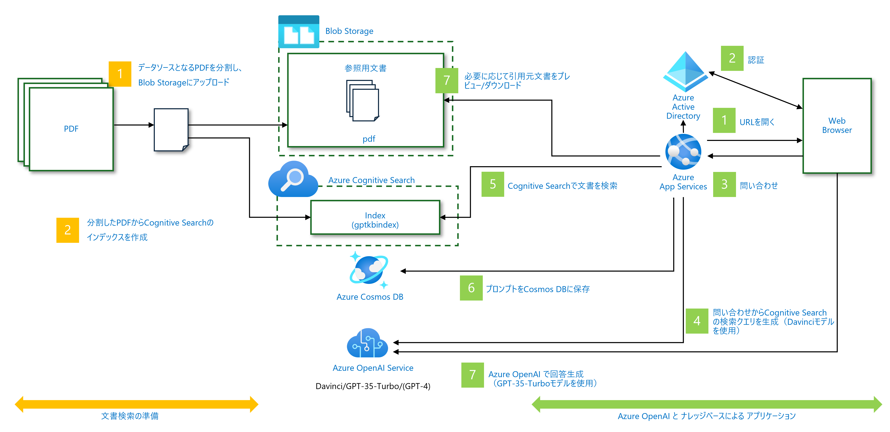

###  アプリの動作確認

まずは出来上がってるアプリケーションの動作を確認してみましょう。
前述のアーキテクチャ図の `1. URLを開く` および `3. 問い合わせ`の部分に該当します。
なおここでは認証設定を行っていませんので、 `2. 認証` の部分はスキップします。

ターミナルには `azd up` の出力の最後の方で、以下のような出力が確認できるはずです。

```pwsh
Section ends with unclosed table, starting next section with the table at page 53 offset 53083 table start 848
Section ends with unclosed table, starting next section with the table at page 71 offset 69609 table start 1122
        Indexed 93 sections, 93 succeeded

Deploying services (azd deploy)

  (✓) Done: Deploying service backend
  - Endpoint: https://app-backend-xxxxxxxxxxxx.azurewebsites.net/

SUCCESS: Your application was provisioned and deployed to Azure in 19 minutes 15 seconds.
You can view the resources created under the resource group rg-aoaiws-eastus in Azure Portal:
https://portal.azure.com/#@/resource/subscriptions/aaaaaaaa-bbbb-cccc-dddddddddddd/resourceGroups/rg-your-envname/overview
```

`Endpoint` として表示されている `.azurewebsites.net` ドメインの URL がサンプルアプリケーションのエンドポイントになっています。
こちらをブラウザで開いて動作を確認してみましょう。


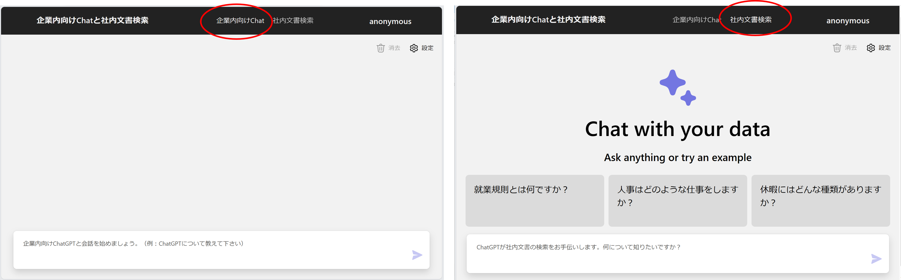

- 企業内向け Chat : Azure OpenAI Service と直接チャットするための画面です
- 社内文書検索 : `data` ディレクトリに格納されている PDF ファイルの内容に基づいて内容をチャットするための画面です

上部のメニューで `社内文書検索` を選択して話しかけると、回答とともに思考プロセスや補助資料が確認できます。

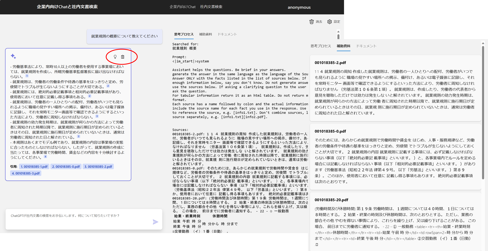


###  構築された Azure 環境の確認

自動的に構築された Azure リソースを確認してみましょう。
先ほどのターミナル出力の最後に `You can view the resources created under the resource group rg-aoaiws-eastus in Azure Portal:` というメッセージとともに URL が表示されています。
こちらをブラウザで開くことで `azd up` で構築された実際の Azure リソースを確認できます。
認証を求められた場合には `az login` や `azd auth login` の実行時に使用したユーザーでサインインしてください。

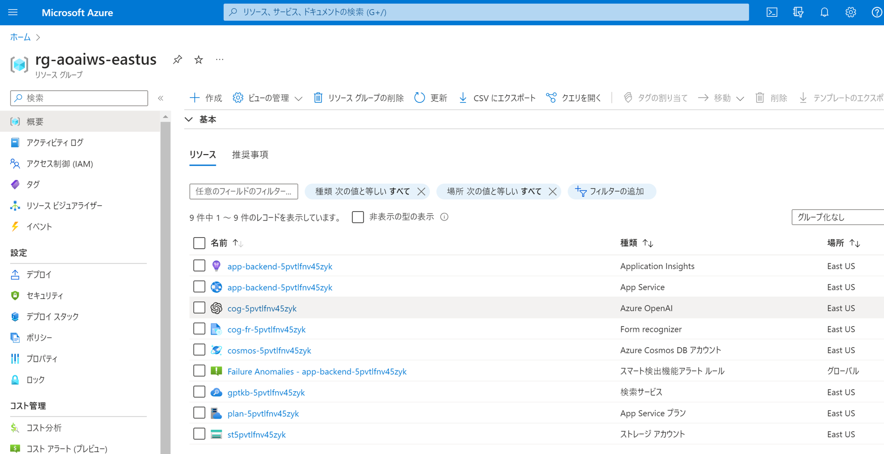

これらのリソースは Bicep テンプレートを使用してデプロイされています。
`infra` ディレクトリに格納されている `main.bicep` 等のファイルがその実体になります。
こちらも併せて中身を確認してみてください。

###  言語モデルを使用した検索クエリの生成

この `社内文書検索` では、まず初めに `4. 問い合わせからCognitive Search の検索クエリを生成` を行っています。
なお画像では `Davinci モデルを使用` との記載がありますが、現在こちらは gpt-35-turbo (0301) モデルを使用しています。
このバージョンのモデルは Davinci モデルと同様に [Completions API](https://learn.microsoft.com/ja-jp/azure/ai-services/openai/how-to/completions)に対応しているため、互換性があります。

Azure OpenAI に対してクエリを生成させるためのプロンプトのテンプレートおよび処理内容が `src/backend/approaches/chatreadretrieveread.py` に実装されています。

```python
# プロンプト部分のテンプレート
query_prompt_template = """Below is a history of the conversation so far, and a new question asked by the user that needs to be answered by searching in a knowledge base about financial documents.
Generate a search query based on the conversation and the new question. 
Do not include cited source filenames and document names e.g info.txt or doc.pdf in the search query terms.
Do not include any text inside [] or <<>> in the search query terms.
generate the search query in the same language as the language of the question.

Chat History:
{chat_history}

Question:
{question}

Search query:
"""
```

どのような結果が生成されるか試してみましょう。

Azure Portal から Azure OpenAI サービスを選択し、`Go to Azure OpenAI Studio` を選択します。
Azure OpenAI Studio 左側にある `Deployments` メニューを開くと、デプロイされたモデルの一覧が表示されます。
名前が紛らわしいですが `davinci` と `chat` という名前の 2 つの gpt-35-turbo(0301) モデルがデプロイされていることが分かります。

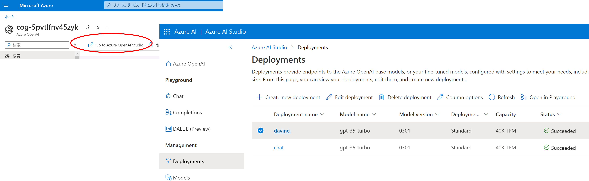

Azure OpenAI Studio 左側にある `Completions` メニューを開き、`davinci` という名前の Deployments を選択します。
先ほどのプロンプトの `Question` を質問文に書き換えて `Generate` を実行します。

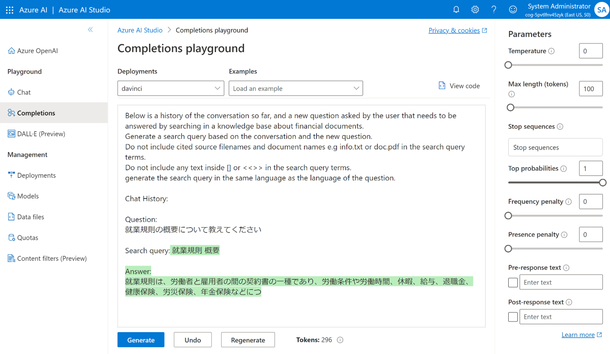

この質問文 `就業規則の概要について教えてください` に対する参考情報を検索するためのクエリキーワードとしては `就業規則` `概要` がよさそうです。

###  検索エンジンによる参考情報の検索

次に `5. Cognitive Search で文書を検索` を確認します。
Azure Portal に戻り Azure Congitive Search を選択します。
左側にある `インデックス` メニューを選択すると、`gptkbindex` という名前のインデックスがすでに作成されていることが分かります。
このインデックスを開くと実際に検索を試すことが出来ますので、先ほどのクエリを入力して検索してみましょう。
キーワードそのままだと大量の結果が返ってきますので、ここでは上位３件に絞っています。

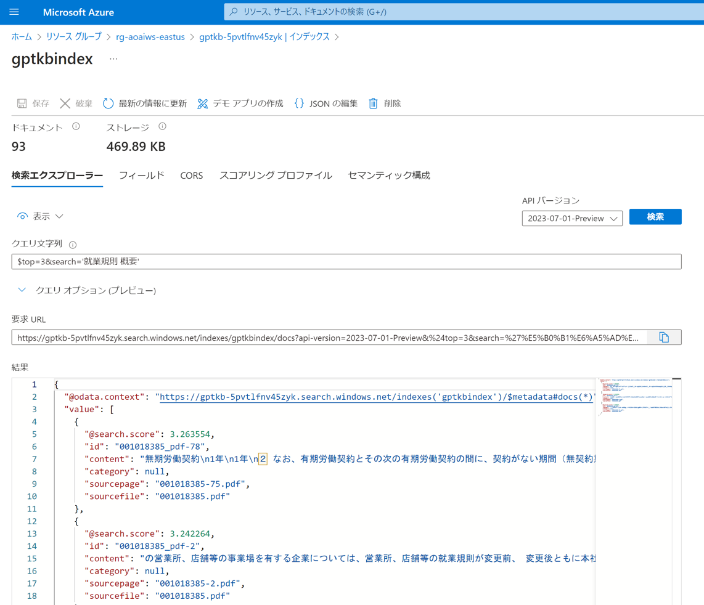

このインデックスは `azd up` 実行時に `azure.yaml` ファイルで定義された `postprovision` 処理として下記が実行され生成されたものです。

1. データソースとなるPDFを分割し、Blob Storageにアップロード
1. 分割したPDFからCognitive Searchのインデックスを作成

こちらに関しては Module 3 を通して確認していきます。

###  検索結果と言語モデルを使用して最終的な回答を生成する

得られた検索結果を元に `7. Azure OpenAI で回答生成` を確認します。
このサンプルでは [ChatML というマークアップ言語](https://learn.microsoft.com/ja-jp/azure/ai-services/openai/how-to/chatgpt?pivots=programming-language-chat-ml) を用いてプロンプトを構成していますので、
その方法に倣ってプロンプトを作っていきます。

まずシステムプロンプトおよび ChatML のテンプレートが `src/backend/approaches/chatreadretrieveread.py` に実装されています。

```python
prompt_prefix_davinci = """<|im_start|>system
{system_prompt}

Sources:
{sources}

<|im_end|>
{chat_history}
"""

system_prompt = """
Assistant helps the questions. Be brief in your answers.
generate the answer in the same language as the language of the Sources.
Answer ONLY with the facts listed in the list of sources below. If there isn't enough information below, say you don't know. Do not generate answers that don't use the sources below. If asking a clarifying question to the user would help, ask the question.
For tabular information return it as an html table. Do not return markdown format.
Each source has a name followed by colon and the actual information, always include the source name for each fact you use in the response. Use square brakets to reference the source, e.g. [info1.txt]. Don't combine sources, list each source separately, e.g. [info1.txt][info2.pdf].
"""
```

システムメッセージ内の Source の部分には検索結果から得られた参照情報を記載します。
今はチャット履歴がありませんのでそこは飛ばしてしまって、上記の後にユーザーメッセージとして最初の質問文を続け、最後にアシスタンスメッセージを促すプロンプトを作成します。
これを Azure OpenAI Studio の Playground で試してみましょう。

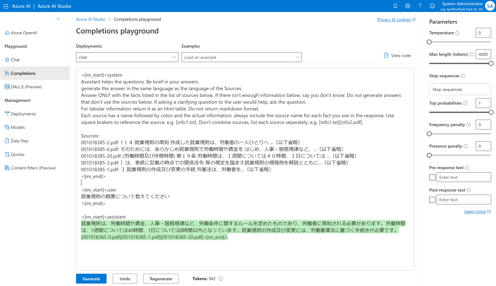

###  チャット履歴の確認

本サンプルアプリケーションでは過去の会話履歴を Cosmos DB に保存しています。
Azure Portal から Azure CosmosDB サービスのリソースを選択し、左側のメニューで `データ エクスプローラー` を選択します。
`ChatHistory` データベース内の `Prompts` コンテナーを展開することで過去の履歴を確認することが可能です。 

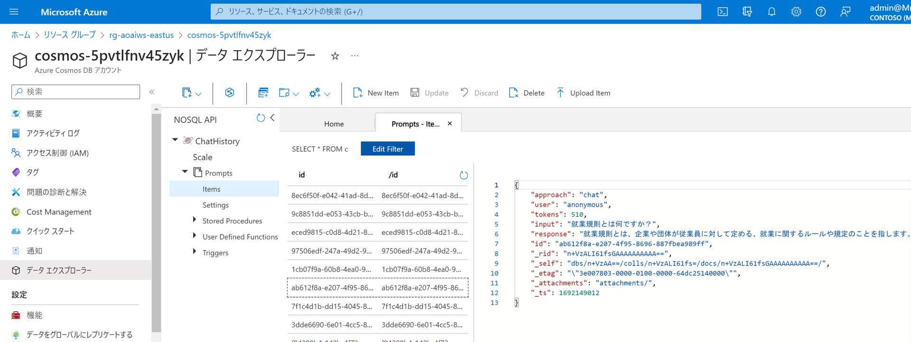

###  光学文字認識（OCR）

本サンプルアプリケーションでは `2. 分割した PDF から Cognitive Search のインデックスを作成` 処理の中で PDF ファイルの内容を Form Recognizer サービスの OCR 機能を使用してテキストデータに変換し、それを元にインデックスを構築しています。
ここでは OCR の動作を確認してみましょう。

Azure Portal から Form Recognizer サービスを開き `Form Recognizer Studio` を起動、`Read` を選択すると利用する Form Recognizeer サービスインスタンスの指定を求められますので、デプロイしたリソースを選択します。

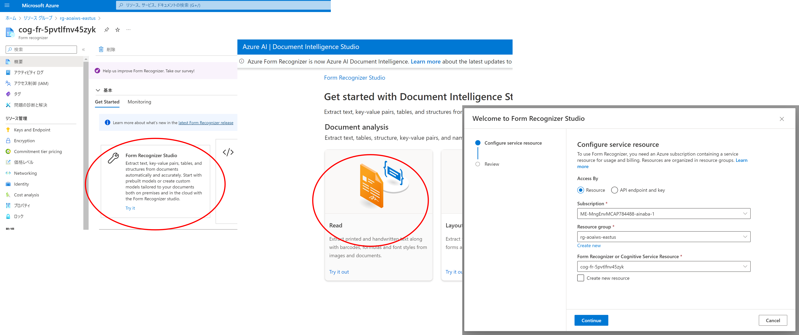

リポジトリの `data` ディレクトリ内に格納されている `001018385.pdf` を選択し、`Run analisys` を選択すると PDF ファイル内の解析が始まります。
しばらくすると各ページの解析結果が表示されます。

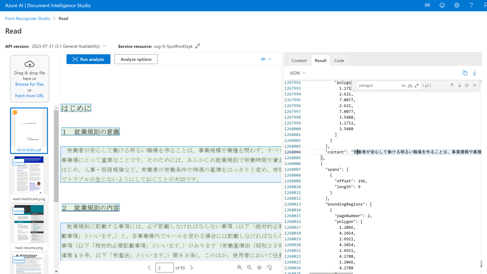

###  分割された PDF ファイル

本サンプルアプリケーションでは回答結果の前提となった参考ドキュメントとして参照できるように、`1.データソースとなるPDFを分割し、Blob Storage にアップロード` しています。
Azure Portal から Storage アカウントを選択し、左側の `コンテナー` メニューを選択すると、`content` という名前のコンテナーが作られていることが分かります。
このコンテナーにはオリジナルの PDF ファイルから、各ページ単位で切り出された PDF ファイルが保存されています。

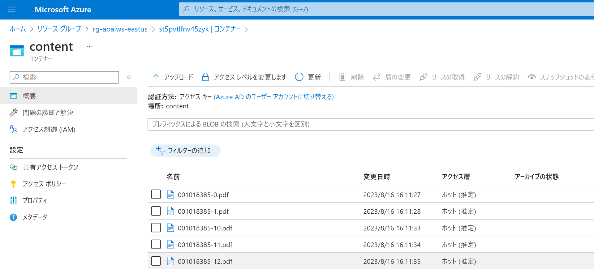


## Module 3 : アプリとデータのカスタマイズ

使用するデータやプロンプトを調整してサンプルをカスタマイズしていきます。

###  開発端末ローカルでのアプリ実行とデバッグの準備

この後のプロンプトの調整等のアプリケーションのカスタマイズの作業を進める上では、開発端末上でアプリケーションをデバッグ実行できると便利です。
バックエンドアプリケーションのソースコードは `src/backend` ディレクトリに格納されているため、こちらを Visual Studio Code で開きます。

```pwsh
code .\src\backend\
```

以降では最初に開いた Visual Studio Code ウィンドウを **VSC1** 、新しく開いた ウィンドウを **VSC2** と表記します。

?> 新しく開いた Visual Studio Code のウィンドウ **VSC2** でデバッグ実行するための構成を行います。

- `Run` メニューから `Add Configuration...` を選択します
- `Select Debugger` で `Python` を選択します
    - ここで `Python` が表示されない場合には `Install extension...` を選択して Python 拡張機能をインストールしてください
- `Debug Configuration` として `Flask` を選択します
- `.vscode/launch.json` ファイルが追加されます

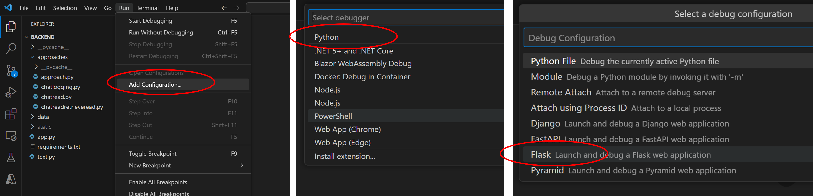

このままでは Azure OpenAI Service や Azure Cognitive Search サービスに接続するためのエンドポイント情報が分からないため、アプリが実行時に読み込める環境変数を設定する必要があります。
これらの値は `azd up` 時に生成された環境固有の `.env` ファイルが使用できるので、`launch.json` の `envFile` 要素で参照します。
環境名部分はご自身の値に書き換えてください。

```json
{
    "version": "0.2.0",
    "configurations": [
        {
            //下記を追記（既存要素は省略してあります）
            "envFile": "${workspaceFolder}/../../.azure/azd-environment-name/.env"
        }
    ]
}
```

アプリケーション実行に必要なモジュールをインストールします。

```powershell, bash
pip install -r requirements.txt
```

準備が完了したら以下の手順でローカル実行およびデバッグを行います。

- 処理を止めたい箇所にブレークポイントを設置
- `Run` メニューから `Start Debugging` を選択
- ターミナルに表示される URL をブラウザで開く
- 画面から処理を実行してブレークポイントで処理が止まることを確認

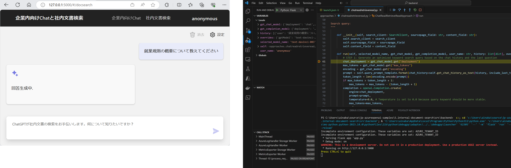


###  プロンプトの調整

アプリケーション内で実装されているプロンプトを調整してみましょう。
先ほど確認した通り `src/backend/approaches/chatreadretrieveread.py` に記述されているシステムメッセージ等が英語になっています。
例えばこれを日本語にしてみましょう。

```python
# クエリ生成のプロンプト
query_prompt_template = """
以下は、これまでの会話の履歴と、財務書類に関するナレッジ ベースで検索して回答する必要があるユーザーからの新しい質問です。
会話と新しい質問に基づいて検索クエリを生成します。
引用されたソース ファイル名やドキュメント名 (info.txt や doc.pdf など) を検索クエリの用語に含めないでください。
検索語句には [] または <<>> 内のテキストを含めないでください。
質問の言語と同じ言語で検索クエリを生成します。

Chat History:
{chat_history}

Question:
{question}

Search query:
"""
```

```python
# ChatML のシステムメッセージ部分のテンプレート
system_prompt = """
アシスタントが質問をサポートします。答えは簡潔にしてください。
ソースの言語と同じ言語で回答を生成します。
以下の情報源のリストに記載されている事実のみを回答してください。
以下に十分な情報がない場合は、わからないと言ってください。
以下のソースを使用しない回答を生成しないでください。
ユーザーに明確な質問をすることが役立つ場合は、質問してください。
表形式の情報の場合は、HTML テーブルとして返します。
マークダウン形式を返しません。
各ソースには名前の後にコロンと実際の情報が続き、応答で使用する各ファクトのソース名を常に含めます。
ソースを参照するには四角形のブラケットを使用します。 例：[info1.txt]
ソースを結合せず、各ソースを個別にリストします。 例：[info1.txt][info2.pdf]。
"""
```

`Run` メニューから `Start Debugging` を選択して実行し、ターミナルに表示された URL からアクセスして動作を確認してみましょう。

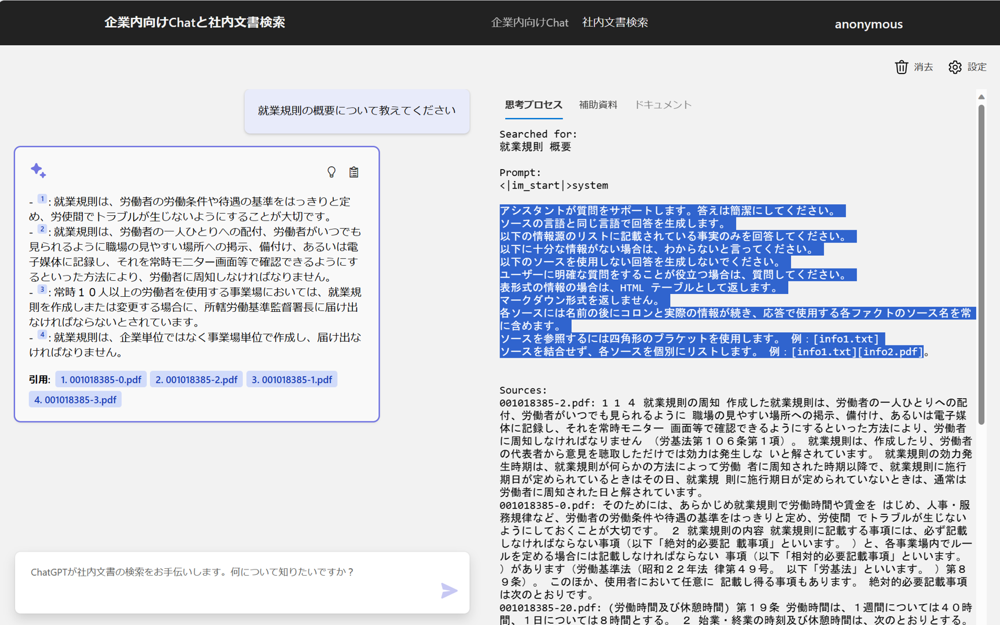

動作確認が終わったらデバッガを停止します。

###  社内文書と役割の変更

?> 最初に開いていた Visual Studio Code のウィンドウ **VSC1** で作業を進めます。

今度はベースとなる社内文書を変更し、AI の役割を変更してみましょう。
まず既存の Cogitive Search サービスに作成された `gptkbindex` インデックスを削除します。
また `data` ディレクトリに配置されている `001018385.pdf` も削除してください。

次にお手持ちの PDF ファイルを `data` ディレクトリに格納してください。
以降では例として [Surface Pro 4 ユーザー ガイド](https://download.microsoft.com/download/2/9/B/29B20383-302C-4517-A006-B0186F04BE28/surface-pro-4-user-guide_ja-jp.pdf) を使用して解説します。
使用する PDF ファイルの内容に基づいて適宜読み替えてください。

ファイルの分割、OCR、インデックスの構築処理は `scripts/prepdocs.py` に実装されています。
呼び出し方が若干複雑ですので、同ディレクトリにある `prepdocs.ps1` や `prepdocs.sh` を使用すると良いでしょう。
Visual Studio Code で開いた際のワークスペース ディレクトリ `5.internal-document-search` から __移動せずに__ 下記を実行します。

<!-- tabs:start -->
###### **Windows**
```powershell
.\scripts\prepdocs.ps1
```
###### **Dev Container**
```bash
./scripts/prepdocs.sh
```
<!-- tabs:end -->

この処理中に Cosmos DB へのアクセスするためのロール定義を作成する箇所でエラーが発生しますが、無視してそのまま続けてしまって構いません。

インデックスの構築が終わったら、今度は使用した PDF ファイルの内容に沿ったプロンプトに書き換えます。
ここでは Surface Pro 4 のカスタマーサポートを想定しています。

?> 新しく開いた Visual Studio Code のウィンドウ VSC2 で作業を進めます。

```python
# クエリ生成のプロンプト
query_prompt_template = """
以下は、これまでの会話の履歴と、Surface Pro 4 に関するナレッジ ベースで検索して回答する必要があるユーザーからの新しい質問です。
会話と新しい質問に基づいて検索クエリを生成します。
引用されたソース ファイル名やドキュメント名 (info.txt や doc.pdf など) を検索クエリの用語に含めないでください。
検索語句には [] または <<>> 内のテキストを含めないでください。
質問の言語と同じ言語で検索クエリを生成します。

Chat History:
{chat_history}

Question:
{question}

Search query:
"""
```

```python
# ChatML のシステムメッセージ部分のテンプレート
system_prompt = """
あなたは Microsoft Surface Pro 4 の専用のヘルプデスク担当者です。
ユーザーからの問い合わせに回答してください。
回答は日本語で生成してください。
Surface の他のバージョンに関する質問には回答しないでください。
Surface 以外の製品に関する質問には回答しないでください。
以下の情報源のリストに記載されている事実のみを回答してください。
以下に十分な情報がない場合は、わからないと言ってください。
以下のソースを使用しない回答を生成しないでください。
ユーザーに明確な質問をすることが役立つ場合は、質問してください。
表形式の情報の場合は、HTML テーブルとして返します。
マークダウン形式を返しません。
各ソースには名前の後にコロンと実際の情報が続き、応答で使用する各ファクトのソース名を常に含めます。
ソースを参照するには四角形のブラケットを使用します。 例：[info1.txt]
ソースを結合せず、各ソースを個別にリストします。 例：[info1.txt][info2.pdf]。
"""
```

`Run` メニューから `Start Debugging` を選択して実行し、ターミナルに表示された URL からアクセスして動作を確認してみましょう。

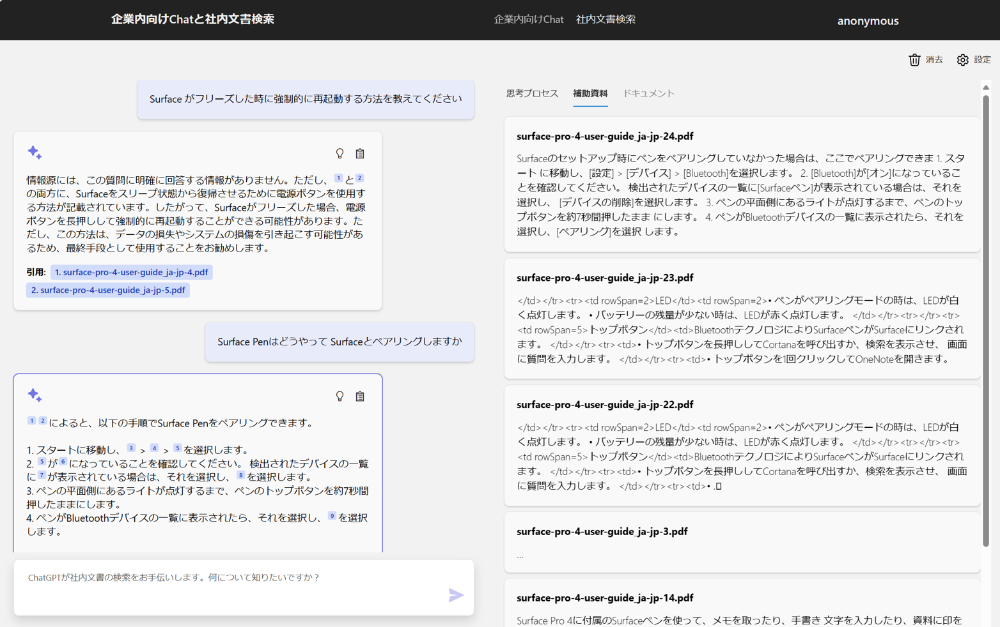

動作確認が終わったらデバッガを停止します。

###  環境へのデプロイ

?> 最初に開いていた Visual Studio Code のウィンドウ **VSC1** で作業を進めます。

カスタマイズしたアプリケーションを Azure 環境にデプロイしてみましょう。
既に Azure リソースは作成済みですので、今度は `azd up` ではなく `azd deploy` を実行します。

```pwsh
azd deploy
```
```pwsh
# 実行結果

✓ built in 16.77s
  (✓) Done: Deploying service backend
  - Endpoint: https://app-backend-5pvtlfnv45zyk.azurewebsites.net/


SUCCESS: Your application was deployed to Azure in 3 minutes 39 seconds.
You can view the resources created under the resource group rg-aoaiws-eastus in Azure Portal:
https://portal.azure.com/#@/resource/subscriptions/3dedf418-2574-41e1-87f9-f7ea51f53648/resourceGroups/rg-aoaiws-eastus/overview
```

表示された Azure App Service の URL を開いて動作を確認してみましょう。

##  Module 4 : 構築した環境の削除

最後に環境を削除します。

```pwsh
azd down
```

本当に消してよいか、格納しているデータも purge してしまってよいか、確認されますので適宜回答してください。

```pwsh
Deleting all resources and deployed code on Azure (azd down)
Local application code is not deleted when running 'azd down'.

Resource group(s) to be deleted:

  • rg-env-name: https://portal.azure.com/#@/resource/subscriptions/aaaaaaaa-bbbb-cccc-dddddddddddd/resourceGroups/rg-env-name/overview
? Total resources to delete: 9, are you sure you want to continue? Yes
Deleting your resources can take some time

  (✓) Done: Deleting resource group: rg-aoaiws-eastus

  Warning: The following operation will delete 1 OpenAI and 1 FormRecognizer.
These resources have soft delete enabled allowing them to be recovered for a period or time after deletion. During this period, their names may not be reused. In the future, you cant use the argument --purge to skip this confirmation.
? Would you like to permanently delete these resources instead, allowing their names to be reused? Yes
  (✓) Done: Purging Cognitive Account: cog-5pvtlfnv45zyk
  (✓) Done: Purging Cognitive Account: cog-fr-5pvtlfnv45zyk

SUCCESS: Your application was removed from Azure in 13 minutes 10 seconds.
```